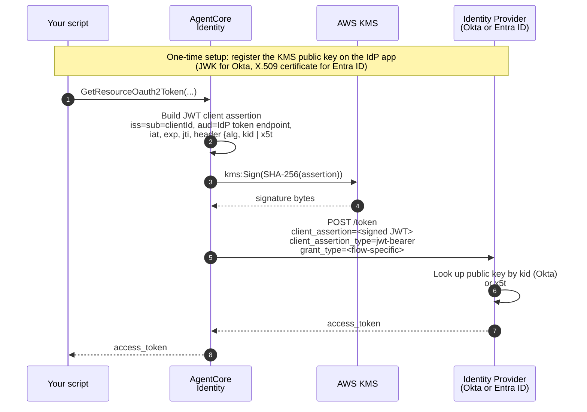

# Outbound Auth with Private Key JWT Client Authentication

| Information         | Details                                                                              |
|:--------------------|:-------------------------------------------------------------------------------------|
| Tutorial type       | Step-by-step                                                                         |
| Agent type          | Single (self-hosted, no AgentCore runtime required)                                  |
| Agentic Framework   | None (standalone Python)                                                             |
| Tutorial components | AgentCore Identity, AWS Key Management Service (AWS KMS), identity provider (Okta or Entra ID) |
| Example complexity  | Intermediate                                                                         |
| SDK used            | boto3                                                                                |
| Credential provider | OAuth2 CustomOauth2 with `PRIVATE_KEY_JWT` client authentication                     |

## What is PRIVATE_KEY_JWT?

Traditionally, an OAuth 2.0 confidential client authenticates to a token
endpoint by sending a **client secret**: a shared string that both sides
know. Both sides have to store and rotate it, both sides can leak it, and
CloudTrail has no way to attest that a particular request came from your
signing key rather than someone who copied the secret.

**PRIVATE_KEY_JWT** (RFC 7523 §2.2) replaces the shared secret with an
**asymmetric key pair**:

- The **private key** stays with the client (in this sample, inside AWS
  KMS, where it never leaves).
- The **public key** is registered on the identity provider (IdP) app
  (as a JWK on Okta, or an X.509 certificate on Entra ID).
- On every token request the client builds a short-lived JWT
  ("assertion"), signs it with the private key, and posts it to the
  IdP's `/token` endpoint. The IdP verifies the signature using the
  registered public key.

The client never transmits the private key; the IdP never sees the
private key; there's no shared secret to leak or rotate.

## How the sample uses PRIVATE_KEY_JWT

AgentCore Identity is the signing party. It holds the credential
provider configuration, calls `kms:Sign` on the KMS key you provisioned,
and posts the assertion to your identity provider on your behalf.



The KMS key is the security anchor. `kms:Sign` is the one AWS API call
that appears in CloudTrail for every token request. The auditability
model is "one CloudTrail event per token, tied to your specific KMS key
via `kms:ViaService`."

## What this sample demonstrates

Three grant flows, two identity providers:

| Flow | What it does                                                             | Okta shape                                              | Entra ID shape                                        |
|:-----|:-------------------------------------------------------------------------|:--------------------------------------------------------|:------------------------------------------------------|
| M2M (machine-to-machine)  | Agent authenticates as itself and requests a token for its own identity  | `client_credentials`                                    | `client_credentials` with `.default` scope            |
| 3LO (three-legged OAuth)  | Browser sign-in mints a user access token (used to seed OBO below)       | authorization_code with PRIVATE_KEY_JWT code exchange   | authorization_code with PRIVATE_KEY_JWT code exchange |
| OBO (on-behalf-of)  | Agent exchanges the user token for a downstream token on the user's behalf | RFC 8693 token-exchange                              | RFC 7523 jwt-bearer + `requested_token_use=on_behalf_of` |

The **same KMS key** signs the assertion for all three flows. The
**same certificate/JWK** proves ownership of that key to the IdP. The
only thing that changes per flow is which grant type AgentCore Identity
requests at the IdP's `/token` endpoint.

## Okta compared to Entra

| Aspect                          | Okta                                                          | Entra ID                                                                    |
|:--------------------------------|:--------------------------------------------------------------|:----------------------------------------------------------------------------|
| Public-key format on the app    | JSON Web Key (JWK)                                            | X.509 certificate                                                            |
| How the cert is built           | Not applicable (JWK is derived directly from the KMS public key)   | Self-signed cert whose **to-be-signed (TBS) portion is signed by `kms:Sign`** |
| Assertion header identifier     | `kid`                                                         | `x5t#S256` (base64url SHA-256 thumbprint)                                    |
| M2M scope                       | Custom scope on the Custom Authorization Server (for example, `api:access`) | `api://<serviceClientId>/.default`                               |
| OBO grant type                  | `urn:ietf:params:oauth:grant-type:token-exchange`             | `urn:ietf:params:oauth:grant-type:jwt-bearer`                                |
| OBO subject-token parameter     | `subject_token`                                               | `assertion`                                                                  |
| OBO extra request parameters    | `subject_token_type=urn:...token-type:access_token`           | `requested_token_use=on_behalf_of`                                           |
| App registration automation     | Okta API token (SSWS scheme)                                   | Microsoft Graph via `az account get-access-token` (no secret in `.env`)      |
| Number of IdP apps needed       | 2 (service + web for 3LO)                                     | 2 (service + web for 3LO)                                                    |
| KMS key alias (sample default)  | `alias/pkjwt-okta-sample-signing-key`                         | `alias/pkjwt-entra-sample-signing-key`                                       |

Refer to the folder that matches your IdP and follow its README. Each is
self-contained and can be run in isolation. The two samples share
nothing at runtime.

## Folder layout

```
05-certificate-based-auth/
├── README.md                             (this file: conceptual overview)
│
├── okta/
│   ├── README.md                              Full Okta walkthrough
│   ├── requirements.txt
│   ├── config.example.env
│   ├── setup/
│   │   ├── 00_provision_signing_key.py         KMS RSA_2048 + key policy
│   │   ├── 01_create_okta_service_app.py       DCR service app + register JWK
│   │   ├── 01a_configure_okta_auth_server.py   Custom AS scope + Access Policy + rule
│   │   ├── 01b_create_okta_login_web_app.py    Web app for 3LO + user assign + Auth Policy
│   │   ├── 02_create_provider_m2m.py           M2M provider (client_credentials)
│   │   ├── 03_create_provider_obo.py           OBO provider (RFC 8693 token-exchange)
│   │   ├── 03b_create_provider_client.py       USER_FEDERATION provider + wire callback
│   │   └── print_manual_okta_instructions.py   Admin-console walkthrough (no SSWS)
│   ├── outbound_private_key_jwt_m2m.py         M2M demo
│   ├── outbound_private_key_jwt_obo.py         OBO demo
│   ├── get_okta_user_jwt.py                    Browser 3LO helper
│   ├── cleanup.py                              Tear down everything
│   ├── diagnose_login_app.py                   Read-only state report
│   └── tests/                                  Offline unit tests
│
└── entra/
    ├── README.md                              Full Entra walkthrough
    ├── requirements.txt
    ├── config.example.env
    ├── setup/
    │   ├── 00_provision_signing_key.py           KMS RSA_2048 + key policy
    │   ├── 01_build_certificate.py               KMS-signed self-signed X.509
    │   ├── 02_create_entra_service_app.py        Service app + upload cert
    │   ├── 02a_configure_entra_permissions.py    App role, delegated scope, Graph perms, consent
    │   ├── 02b_create_entra_login_web_app.py     Web app for 3LO + Graph perms + service-app perm
    │   ├── 03_create_provider_m2m.py             M2M provider (client_credentials)
    │   ├── 04_create_provider_obo.py             OBO provider (RFC 7523 jwt-bearer)
    │   ├── 04b_create_provider_client.py         USER_FEDERATION provider + wire callback
    │   ├── _entra_graph.py                       Shared Graph helpers
    │   └── print_manual_entra_instructions.py    Admin-center walkthrough (no az)
    ├── outbound_private_key_jwt_m2m.py           M2M demo
    ├── outbound_private_key_jwt_obo.py           OBO demo
    ├── get_entra_user_jwt.py                     Browser 3LO helper
    ├── cleanup.py                                Tear down everything
    ├── diagnose_entra_apps.py                    Read-only state report
    └── tests/                                    Offline unit tests
```

## Prerequisites

- Python 3.10 or later
- AWS CLI v2 configured with credentials that can call
  `bedrock-agentcore-control`, `bedrock-agentcore`, `kms`, and `sts`
- `pip install -r <flavor>/requirements.txt`
- One identity provider tenant (Okta developer org, or Entra ID tenant)
  with permission to create and configure app registrations
- For Entra: Azure CLI (`az login` once per session; no client secret
  needs to be in `.env`)

## When to use `PRIVATE_KEY_JWT`

Consider this pattern when:

- You'd rather not rely on long-lived shared secrets, and want to avoid
  storing, distributing, and rotating them.
- Your identity provider recommends or requires `private_key_jwt` for
  confidential clients (Entra ID always accepts it; Okta calls it
  "Public Key Authentication").
- You want per-token-request auditability: every downstream token
  request produces exactly one `kms:Sign` CloudTrail entry tied to your
  specific KMS key.

## Concepts to review

- [Client authentication methods (AgentCore docs)](https://docs.aws.amazon.com/bedrock-agentcore/latest/devguide/client-auth-methods.html)
- [Private Key JWT (AgentCore docs)](https://docs.aws.amazon.com/bedrock-agentcore/latest/devguide/private-key-jwt.html): algorithm-to-key-spec table and KMS key policy example
- [RFC 7523: JWT Profile for OAuth 2.0 Client Authentication](https://datatracker.ietf.org/doc/html/rfc7523)
- [RFC 8693: OAuth 2.0 Token Exchange](https://datatracker.ietf.org/doc/html/rfc8693) (used by the Okta OBO flow)
- [Microsoft Entra ID OBO flow](https://learn.microsoft.com/en-us/entra/identity-platform/v2-oauth2-on-behalf-of-flow) (used by the Entra OBO flow)

## Where the operational value shows up

Compared to `CLIENT_SECRET_POST` or `CLIENT_SECRET_BASIC`, this pattern
replaces the client secret with a KMS-hosted asymmetric key. Two
operational consequences:

1. **No secret to rotate on the AgentCore side.** Rotation becomes
   "generate a new KMS key, register the new public key at your
   identity provider, update the credential provider ARN." No shared
   secret is written, stored, or transported.
2. **Every token request is signed with a `kms:Sign` call.** This shows
   up in CloudTrail as an auditable event tied to
   `kms:ViaService = bedrock-agentcore-identity.*.amazonaws.com`.
   Data-plane events on `bedrock-agentcore` (like
   `GetResourceOauth2Token`) require explicit data-event configuration
   in your trail, but the `kms:Sign` event is always logged.
