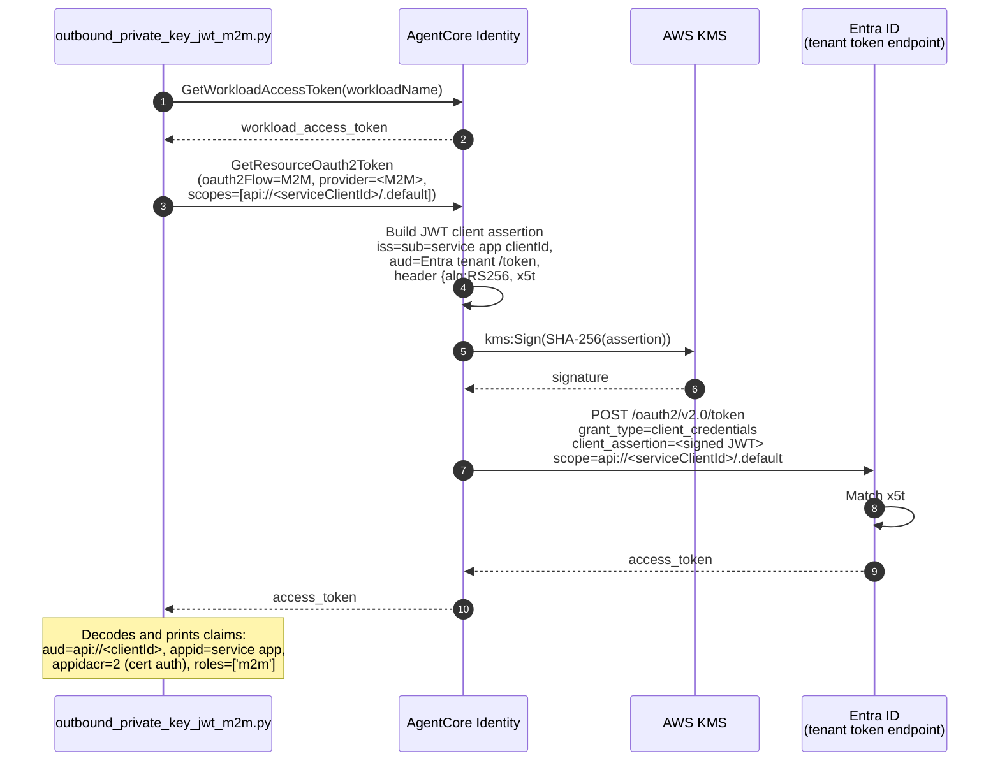
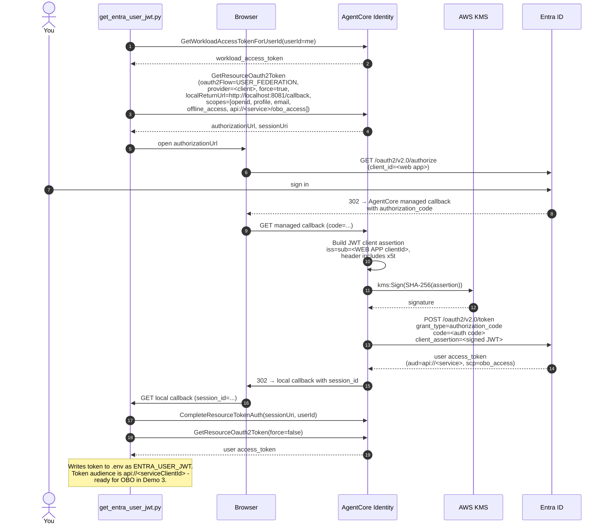
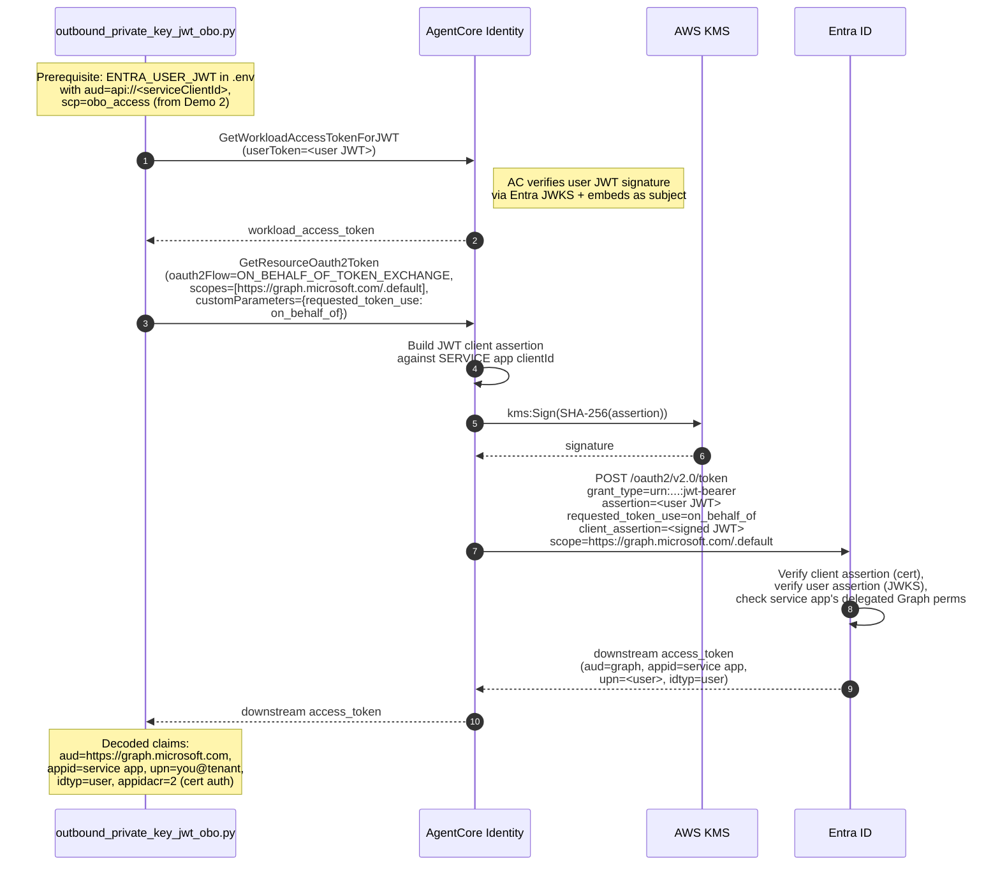

# PRIVATE_KEY_JWT with Microsoft Entra ID

End-to-end walkthrough for AgentCore Identity's PRIVATE_KEY_JWT client
authentication against Microsoft Entra ID, covering both:

- **M2M** (machine-to-machine): an agent obtaining its own tokens
  (`client_credentials`).
- **OBO** (on-behalf-of): an agent obtaining a token on behalf of an end
  user (RFC 7523 jwt-bearer + `requested_token_use=on_behalf_of`),
  including the browser three-legged OAuth (3LO) helper that mints the
  user's assertion token in the
  first place.

Both flows use a single AWS Key Management Service (AWS KMS) asymmetric key to sign JWT client
assertions. The private key never leaves KMS: the certificate uploaded
to Entra is self-signed via `kms:Sign`, so the private half exists only
inside AWS KMS at every step.

| Property            | Value                                                            |
|:--------------------|:-----------------------------------------------------------------|
| Identity provider   | Microsoft Entra ID (single-tenant App Registrations)             |
| Public-key format   | Self-signed X.509 certificate on the app's `keyCredentials`      |
| Cert signature      | KMS-signed to-be-signed (TBS) portion (RSASSA-PKCS1-v1_5-SHA-256) |
| Assertion algorithm | RS256 (Entra also accepts PS256 and ES256; this sample uses RS256)|
| KMS key spec        | RSA_2048, Origin=AWS_KMS                                          |
| Grant flows shown   | client_credentials, authorization_code (3LO), jwt-bearer OBO      |

## What this sample builds

Three AgentCore Identity credential providers, two Entra app
registrations, one KMS-hosted signing key, and one workload identity -
all wired together so the three grant flows above share the same
private key.

```
                              ┌───────────────────────────────┐
                              │  AWS KMS (RSA_2048, AWS_KMS)  │
                              │  alias: pkjwt-entra-sample-*  │
                              └──────────────┬────────────────┘
                                             │ kms:Sign
                                             │ (assertions + cert TBS)
        ┌─────────────────┬──────────────────┼──────────────────┬───────────────────┐
        │                 │                  │                  │                   │
  ┌─────┴───────┐   ┌─────┴──────┐    ┌──────┴──────┐    ┌──────┴──────┐    ┌───────┴──────┐
  │ M2M provider│   │ OBO provider│   │ Client prov │    │ Entra       │    │ Entra login  │
  │ CustomOauth2│   │ CustomOauth2│   │ (3LO/authz) │    │ SERVICE app │    │ WEB app      │
  │ client_creds│   │ jwt-bearer  │   │ authz_code  │    │ + cert      │    │ + same cert  │
  └─────┬───────┘   └─────┬──────┘   └──────┬──────┘    └─────────────┘    └──────────────┘
        │                 │                  │
        └─────────────────┴──────────────────┘
                          │
                          ▼
              ┌───────────────────────┐
              │ Entra tenant          │
              │ /token endpoint       │
              │ (client_assertion +   │
              │  requested grant)     │
              └───────────────────────┘
```

Two Entra apps, one KMS key, one cert:

- The **service app** (API-services type) is the caller in M2M and the
  caller in OBO. Its `appId` is the `appid` on every downstream token.
- The **web app** (Web platform) is only used for user 3LO, the leg
  that produces the user assertion that OBO then exchanges.

They share the same KMS-signed X.509 certificate because the KMS key is
what the sample wants to demonstrate. Different Entra apps, one signing
key.

## Which flow do I need?

| If you want to demonstrate...                                        | Run                                              |
|:---------------------------------------------------------------------|:-------------------------------------------------|
| Agent calling a downstream API as itself (M2M)                       | Setup 00, 01, 02, 02a, 03 → demo M2M              |
| Agent calling a downstream API on behalf of a user (OBO)             | All setup steps → get_entra_user_jwt → demo OBO   |

Everything below assumes the full OBO path. Skip 02b and 04b if you
only need M2M.

## Prerequisites

1. **Entra tenant**: a Microsoft Entra tenant where you can create App
   Registrations, grant admin consent tenant-wide, and expose an API URI.
   A free [Microsoft 365 Developer](https://developer.microsoft.com/microsoft-365/dev-program)
   tenant works.
2. **Azure CLI**: `az` installed and logged in against your Entra
   tenant. Run `az login` once per session. All setup scripts fetch
   Microsoft Graph tokens on demand via `az account get-access-token` -
   no secret needs to live in `.env`.

   If your Entra tenant has no active Azure subscription attached
   (common for developer/test tenants), plain `az login` fails.
   Use the tenant-scoped variant instead:

   ```bash
   az login --tenant <tenant-id> --allow-no-subscriptions
   ```

   Your tenant ID is on Microsoft Entra ID → Overview. The
   `--allow-no-subscriptions` flag tells `az` not to require an Azure
   subscription in that tenant (we only need Microsoft Graph, not
   Azure Resource Manager).
3. **AWS credentials** with permission to call `kms`, `sts`, and
   `bedrock-agentcore-control`.
4. **Python 3.10+.**

Optional: if you'd rather not use `az`, see
[Manual Entra configuration](#manual-entra-configuration-alternative-to-the-automated-path)
below.

## One-time setup

Run all commands from this sample's `entra/` folder.

```bash
cd 05-certificate-based-auth/entra

# Python environment
python3 -m venv .venv
source .venv/bin/activate         # macOS / Linux
# .venv\Scripts\activate          # Windows PowerShell
pip install --upgrade pip
pip install -r requirements.txt

# Configuration
cp config.example.env .env
# Edit .env - see below.
```

### Configure `.env`

You have to set at minimum:

| Key                    | What it is                                                     |
|:-----------------------|:---------------------------------------------------------------|
| `AWS_REGION`           | Region for the KMS key + AgentCore resources.                  |
| `ENTRA_TENANT_ID`      | Optional; setup/02 discovers it from your `az` session.       |

Everything else in `config.example.env` has sensible defaults. Setup
scripts write ids back into `.env`. Leave those keys blank so the
scripts populate them.

### Run the setup pipeline

Each step is idempotent, prints a **Summary** block explaining what it
created, and tells you the exact next command.

```bash
# Step 0 - provision the KMS signing key + alias + key policy.
python setup/00_provision_signing_key.py

# Step 1 - build the self-signed X.509 certificate. The cert's public
# key IS the KMS public key; its TBS is signed by kms:Sign.
python setup/01_build_certificate.py

# Step 2 - create the Entra service app via Microsoft Graph. Upload
# the certificate to its keyCredentials. Ensure its service principal
# exists.
python setup/02_create_entra_service_app.py

# Step 2a - expose an API URI, create the 'm2m' app role, grant it
# to the app on itself, admin-consent the tenant.
python setup/02a_configure_entra_permissions.py

# ─── OBO-only branch (skip if you only want M2M) ───

# Step 2b - create the second Entra app (web) used by the browser 3LO
# flow. Same certificate. Delegated Microsoft Graph permissions
# (openid + profile + email + offline_access + User.Read) with tenant-
# wide admin consent.
python setup/02b_create_entra_login_web_app.py

# ─── AgentCore identity providers ───

# Step 3 - M2M credential provider (client_credentials).
python setup/03_create_provider_m2m.py

# Step 4 - OBO credential provider (jwt-bearer, JWT_AUTHORIZATION_GRANT).
python setup/04_create_provider_obo.py

# ─── OBO-only, cont. ───

# Step 4b - client credential provider for the USER_FEDERATION 3LO
# flow. Also wires AgentCore Identity's managed callback URL onto the
# Entra web app's redirectUris and adds your local callback URL to the
# workload identity's allowed list.
python setup/04b_create_provider_client.py
```

Each script terminates with a Summary block similar to:

```
======================================================================
  Summary - step 02: Entra service app registration
======================================================================
  What was created (or reused):
    Label                     : AgentCore Identity Private Key JWT Sample
    Application (client) ID   : 38f05f91-c82d-4625-9fd0-8cd1e8c4f239
    App object ID             : 5a6f...
    Service Principal ID      : ceff...
    Sign-in audience          : AzureADMyOrg (single-tenant)
    Client credential         : X.509 cert (private_key_jwt)
                                x5t#S256 = oSjGK3BTBOP...

  Where to inspect it in the Entra admin center:
    Microsoft Entra ID → App registrations → 'AgentCore Identity ...'
    Certificates & secrets → Certificates tab (should show the cert)
    Overview tab shows both Application ID and Object ID (they differ!)
    Direct URL:
      https://entra.microsoft.com/#view/.../appId/<clientId>

  Written to .env:
    ENTRA_TENANT_ID=...
    ENTRA_SERVICE_APP_OBJECT_ID=...
    ENTRA_SERVICE_CLIENT_ID=...
    ENTRA_SERVICE_SP_OBJECT_ID=...

  Why this step matters:
    This is the confidential client that authenticates to Entra's
    /token endpoint on every M2M or OBO call. ...

  Next step:
    python setup/02a_configure_entra_permissions.py
```

## Manual Entra configuration (alternative to the automated path)

Everything above assumes `az login`. If you'd rather do the Entra side
by hand (or your admin won't grant Microsoft Graph write permissions),
this section is for you.

### When you'd choose this path

- Your org's Entra admin controls App Registration creation and won't
  hand you Graph write permission.
- You want to review every field before Graph writes it.
- You're demoing in a shared tenant and can't script.

### How it works

1. Skip the Entra-Graph scripts. Everything else stays automated.

   | Step  | Automated path                                     | Manual path                                        |
   |:------|:---------------------------------------------------|:---------------------------------------------------|
   | 00    | `python setup/00_provision_signing_key.py` (KMS)   | same                                               |
   | 01    | `python setup/01_build_certificate.py` (cert)      | same                                               |
   | 02    | `python setup/02_create_entra_service_app.py`      | Click through admin center (see helper below)      |
   | 02a   | `python setup/02a_configure_entra_permissions.py`  | Click through admin center                         |
   | 02b   | `python setup/02b_create_entra_login_web_app.py`   | Click through admin center (OBO only)              |
   | 03    | `python setup/03_create_provider_m2m.py`           | same                                               |
   | 04    | `python setup/04_create_provider_obo.py`           | same                                               |
   | 04b   | `python setup/04b_create_provider_client.py`       | Provider still created; redirectUri PATCH prints as a manual step |

2. Generate the click-by-click instructions:

   ```bash
   python setup/00_provision_signing_key.py         # still needed - KMS
   python setup/01_build_certificate.py             # still needed - cert
   python setup/print_manual_entra_instructions.py  # full walkthrough
   # or:
   python setup/print_manual_entra_instructions.py --m2m
   python setup/print_manual_entra_instructions.py --obo
   ```

   The helper reads `entra_cert.pem` (built by setup/01) and prints:
   - The **exact certificate PEM** to upload to each app.
   - Step-by-step Entra admin center navigation with every field value
     the automated path would have set.
   - Which `.env` keys to fill in after each screen.

3. After the console clicks, fill in `.env` by hand:

   ```
   ENTRA_TENANT_ID=<Directory (tenant) ID>
   ENTRA_SERVICE_APP_OBJECT_ID=<service app Object ID>
   ENTRA_SERVICE_CLIENT_ID=<service app Application (client) ID>
   ENTRA_SERVICE_SP_OBJECT_ID=<service principal Object ID from Enterprise applications>

   # OBO-only
   ENTRA_LOGIN_APP_OBJECT_ID=<web app Object ID>
   ENTRA_LOGIN_CLIENT_ID=<web app Application (client) ID>
   ```

4. Run the AgentCore-side scripts as usual:

   ```bash
   python setup/03_create_provider_m2m.py
   python setup/04_create_provider_obo.py
   python setup/04b_create_provider_client.py    # OBO only
   ```

   `setup/04b` prints AgentCore's managed callback URL. Return to your
   login web app's Authentication blade and add that URL as a Redirect
   URI (replacing the placeholder).

### What manual mode can't do for you

- **`cleanup.py`** still calls Microsoft Graph via `az`. Without an az
  session it skips the Entra side and only tears down AgentCore + KMS.
  Delete the apps manually in the admin center if you need a full
  reset.
- **`diagnose_entra_apps.py`** also needs `az` (it's read-only but goes
  through Graph).

## Demo 1: M2M

```bash
python outbound_private_key_jwt_m2m.py
```

### Sequence



Details of each step:

1. `GetWorkloadAccessToken`: a short-lived workload identity token
   identifying this agent.
2. `GetResourceOauth2Token(oauth2Flow=M2M, provider=<M2M provider>)`.
   AgentCore Identity:
   - Builds a JWT client assertion: `iss=sub=<service app appId>`,
     `aud=<Entra tenant /token endpoint>`, `jti`, `iat`, `exp`, header
     `{alg:RS256, x5t#S256:<thumbprint>}`.
   - Calls `kms:Sign` against your KMS key.
   - POSTs to Entra's `/token` with `grant_type=client_credentials`,
     `client_assertion`, and
     `client_assertion_type=urn:ietf:params:oauth:client-assertion-type:jwt-bearer`.
   - Scope defaults to `api://<ENTRA_SERVICE_CLIENT_ID>/.default`.
3. Prints the returned token and decoded claims.

**What a successful run looks like:**

```
======================================================================
  M2M access token retrieved via PRIVATE_KEY_JWT client assertion
======================================================================
  Decoded claims:
    iss      : https://sts.windows.net/<tenant-id>/
    aud      : api://<service app appId>
             ↳ Audience - the API this token is for
    appid    : <service app appId>
             ↳ AppId - your service app (also the caller identity)
    appidacr : 2
             ↳ App auth method - '2' means certificate (PRIVATE_KEY_JWT)
    roles    : ['m2m']
             ↳ App roles granted (from setup/02a's m2m role)
    oid      : <object id of service principal>
    tid      : <tenant id>
    ...
```

Key invariants to confirm:

- `appid` is your **service app's** `ENTRA_SERVICE_CLIENT_ID` from `.env`.
- `appidacr` is `"2"`, which proves certificate auth.
- `roles` contains `"m2m"` (from `setup/02a`).

## Demo 2: Get a user JWT for OBO (browser 3LO)

OBO needs a user access token as the RFC 7523 assertion. This helper
does the AgentCore-mediated USER_FEDERATION flow:

```bash
python get_entra_user_jwt.py
```

### Sequence



Details of each step:

1. `GetWorkloadAccessTokenForUserId`: workload token bound to
   `USER_ID_3LO`.
2. `GetResourceOauth2Token(oauth2Flow=USER_FEDERATION, forceAuthentication=true)`
   → AgentCore returns an authorization URL.
3. Your default browser opens Entra's authorize endpoint. Sign in with
   the Entra user you want the token to represent.
4. Entra redirects to **AgentCore's managed callback URL**, which does
   the authorization_code exchange with Entra using PRIVATE_KEY_JWT
   (KMS-signed client assertion against your web app).
5. AgentCore stores the user tokens in its vault and redirects to your
   local callback URL with a `session_id`.
6. `CompleteResourceTokenAuth` binds the session to `USER_ID_3LO`.
7. A second `GetResourceOauth2Token` (`forceAuthentication=false`)
   fetches the stored access token.
8. Script writes the token to `.env` as `ENTRA_USER_JWT`.

**What a successful run looks like:**

```
✓ Received user access token (length=1042)

======================================================================
  User access token issued by Entra
======================================================================
  Decoded claims:
    appid              : <login web app appId>   ← the WEB app, not service
    appidacr           : 2
                         ↳ Cert auth (PRIVATE_KEY_JWT)
    idtyp              : user
    upn                : you@yourtenant.onmicrosoft.com
    name               : Your Display Name
    oid                : <your Entra user object id>
    scp                : email openid profile User.Read
    ...
```

Note that `appid` here is the **web app**, not the service app. That
distinction matters: the OBO exchange in the next step swaps this
token for one whose `appid` is the service app.

## Demo 3: OBO (RFC 7523 jwt-bearer)

```bash
python outbound_private_key_jwt_obo.py
```

### Sequence



Details of each step:

1. Reads `ENTRA_USER_JWT` from `.env`.
2. `GetWorkloadAccessTokenForJWT` embeds the user JWT as the subject
   of a workload access token.
3. `GetResourceOauth2Token(oauth2Flow=ON_BEHALF_OF_TOKEN_EXCHANGE, provider=<OBO provider>)`.
   AgentCore Identity:
   - Builds a JWT client assertion signed by KMS against the **service
     app's** `appId`.
   - POSTs to Entra's `/token` with:
     - `grant_type=urn:ietf:params:oauth:grant-type:jwt-bearer`
     - `assertion=<user JWT>`
     - `requested_token_use=on_behalf_of`  (via `customParameters`)
     - `client_assertion=<KMS-signed JWT>`
     - `scope=https://graph.microsoft.com/.default` (default; override
       with `--scope`)
4. Prints the exchanged token and its claims.

**What a successful run looks like:**

```
======================================================================
  On-behalf-of token retrieved via PRIVATE_KEY_JWT client assertion
======================================================================
  Decoded claims:
    aud             : https://graph.microsoft.com
    appid           : <SERVICE app appId>   ← the SERVICE app
                      ↳ AppId - proves the caller is your agent
    appidacr        : 2
    idtyp           : user
    upn             : you@yourtenant.onmicrosoft.com
    name            : Your Display Name
    scp             : User.Read profile openid email
    ...
```

Key invariant: `appid` is the service app, `upn`/`name` identify the
end user, and `aud` is the downstream resource (Microsoft Graph by
default). That's the OBO shape: the downstream API can enforce
user-level permissions (`upn`/`oid`) and still log which agent called
it (`appid`).

## Verifying in the Entra admin center

If a demo misbehaves, use these entry points to confirm what actually
got created in your tenant:

| Artifact                    | Where to look                                                                        |
|:----------------------------|:--------------------------------------------------------------------------------------|
| Service app                 | Microsoft Entra ID → App registrations → AgentCore Identity Private Key JWT Sample.   |
| Web app (OBO)               | Microsoft Entra ID → App registrations → AgentCore Identity Private Key JWT Login App. |
| Certificate on either app   | The app's Certificates & secrets → Certificates tab.                                  |
| Exposed API URI + app role  | Service app → Expose an API + App roles.                                              |
| Admin consent state         | Service app → API permissions (green Granted state on the m2m role).                  |
| Delegated Graph permissions | Login web app → API permissions (all five Graph scopes should be granted).            |
| Redirect URIs               | Login web app → Authentication → Web platform.                                        |
| Failed auth events          | Microsoft Entra ID → Monitoring → Sign-in logs.                                       |

Every setup script prints a **Direct URL** in its Summary block for
the resource it just created. Copy-paste that instead of navigating
the menus.

## Diagnostic helper

If the demos fail after successful setup, run:

```bash
python diagnose_entra_apps.py
```

Read-only Graph API report on both app registrations: keyCredentials
(with cert-thumbprint match check), redirectUris, appRoles, delegated
Graph permissions, and admin-consent grants (`oauth2PermissionGrants`
and `appRoleAssignedTo`). Read the output before assuming anything
about state.

## Troubleshooting

Common failure modes and where to look:

### `AADSTS700027: Client assertion contains an invalid signature` (or "failed signature validation")

Cause: the `x5t#S256` header in the JWT assertion doesn't match any
uploaded certificate on the Entra app, or the certificate's public key
doesn't match the KMS key AgentCore Identity used to sign.

Fix:
1. Confirm `X5T_S256_THUMBPRINT` in `.env` matches the thumbprint of
   the cert uploaded to the app: run `python diagnose_entra_apps.py`.
2. If they don't match, re-run `setup/02` (and `02b`) to upload the
   correct cert.
3. If they do match, the cert on the app is stale, likely from a
   prior KMS key. Delete it in the admin center, then re-run setup/02.

### `AADSTS50013: Assertion failed signature validation`

Cause: the subject `assertion` in the OBO call is not signed by a key
that Entra can verify (typically an expired or malformed user JWT).

Fix: re-run `python get_entra_user_jwt.py` to mint a fresh user token.

### `Invalid Signature for bearerToken` on `GetWorkloadAccessTokenForJWT`

Cause: your `ENTRA_USER_JWT` was minted with a Microsoft Graph audience.
Graph access tokens are nonce-protected: their signatures can't be
verified through standard JWKS lookup, so AgentCore Identity rejects
them at the workload-token step.

Fix: mint a user token audienced at the service app instead. That
means requesting `api://<ENTRA_SERVICE_CLIENT_ID>/obo_access` in the
3LO scope list. The default in `get_entra_user_jwt.py` already does
this. If you overrode `--scope` to include `User.Read` or another
Graph scope, drop it and use the default.

### OBO exchange returns HTTP 400 (post-workload-token step)

Cause: the SERVICE app (middle-tier) doesn't have the required
delegated permissions on the downstream API. Entra checks this
during the OBO exchange and rejects with a 400.

Fix: re-run `python setup/02a_configure_entra_permissions.py`. Its
current version grants Microsoft Graph delegated perms (openid,
profile, email, offline_access, User.Read) to the service app and
admin-consents them. If you're on an older revision, pull the latest.

### `AADSTS65001: The user or administrator has not consented to use the application`

Cause: admin consent is missing on one of the delegated permissions.

Fix: re-run `setup/02b_create_entra_login_web_app.py`. It re-posts
`oauth2PermissionGrants` with `consentType=AllPrincipals`. Or, in the
admin center: App registrations → login web app → API permissions →
'Grant admin consent for <tenant>'.

### `AADSTS7000215: Invalid client secret provided`

Cause: the app still has a client secret configured and Entra is
trying to use it. Since this sample uses certificate-based auth only,
that secret is confusing Entra.

Fix: App registrations → your app → Certificates & secrets → Client
secrets tab → delete any secrets.

### `AADSTS700016: Application not found in the directory`

Cause: `ENTRA_TENANT_ID` in `.env` points at a different tenant than
where the app was created, or the app was deleted.

Fix: run `az account show --query tenantId -o tsv` and confirm it
matches `.env`. If the app really is gone, re-run the full setup
pipeline.

### `az` not installed / not logged in

The setup scripts fail with a clear message pointing you at the manual
instructions. Either `az login` first, or run
`python setup/print_manual_entra_instructions.py`.

### `openid` scope rejected on client_credentials

You can't request `openid` on the M2M grant against Entra. The scope
must be a `.default` scope tied to an app the caller has permission
on. The default scope in `outbound_private_key_jwt_m2m.py`
(`api://<serviceClientId>/.default`) is correct. Don't override it
with `openid`.

### Other tenant-level gotchas

- **Application (client) ID versus Object ID.** Entra apps have two GUIDs.
  The `client_id` (aka `appId`) goes in the credential provider config
  and the JWT assertion. The `objectId` goes in Graph API URLs like
  `PATCH /applications/{objectId}`. Setup scripts persist both.
- **KMS key policy needs an AgentCore-scoped statement.** Otherwise
  `kms:Sign` at token-request time fails with `AccessDenied`. See the
  policy `setup/00_provision_signing_key.py` builds.
- **The cert's TBS is KMS-signed.** That's what makes Path B work
  end-to-end without exporting the private key. You cannot generate
  the cert with plain `openssl` because the private key never leaves
  KMS.

## Cleanup

One consolidated script tears down everything setup created:

```bash
python cleanup.py               # normal cleanup, keeps KMS
python cleanup.py --dry-run     # preview what would be deleted
python cleanup.py --delete-kms  # also schedule the KMS key for deletion
python cleanup.py --keep-env    # don't blank .env values
python cleanup.py --keep-cert   # keep entra_cert.pem + .der on disk
```

What `cleanup.py` deletes:

- The three AgentCore credential providers (`CLIENT_PROVIDER_NAME`,
  `OBO_PROVIDER_NAME`, `M2M_PROVIDER_NAME`) and the workload identity.
- Both Entra app registrations, deleted via Graph API using object
  IDs stored in `.env`. Requires `az login`. If az is unavailable,
  cleanup prints the object IDs for manual deletion.
- The local `entra_cert.pem` and `entra_cert.der` files.
- Setup-populated `.env` keys (KMS ARN kept by default).

After cleanup, re-run the full setup pipeline to rebuild.

## File reference

| File                                       | Role                                                                                     |
|:-------------------------------------------|:-----------------------------------------------------------------------------------------|
| `setup/00_provision_signing_key.py`        | Create the KMS RSA_2048 key and its key policy.                                          |
| `setup/01_build_certificate.py`            | Build the KMS-signed self-signed X.509 cert (Path B).                                    |
| `setup/02_create_entra_service_app.py`     | Create the Entra service app via Graph; upload cert to keyCredentials.                   |
| `setup/02a_configure_entra_permissions.py` | Expose API URI, create m2m app role, grant admin consent.                                |
| `setup/02b_create_entra_login_web_app.py`  | (OBO) Create the login web app; upload same cert; add delegated Graph perms + consent.   |
| `setup/03_create_provider_m2m.py`          | Create the M2M CustomOauth2 provider.                                                    |
| `setup/04_create_provider_obo.py`          | Create the OBO CustomOauth2 provider (JWT_AUTHORIZATION_GRANT).                          |
| `setup/04b_create_provider_client.py`      | (OBO) Create the USER_FEDERATION provider; wire callback URLs.                           |
| `setup/print_manual_entra_instructions.py` | Print a click-by-click Entra admin center walkthrough (no az required).                  |
| `setup/_entra_graph.py`                    | Shared Graph API helpers (token, GET/POST/PATCH/DELETE, error handling).                 |
| `get_entra_user_jwt.py`                    | (OBO) Browser 3LO via AgentCore → writes `ENTRA_USER_JWT` to `.env`.                     |
| `outbound_private_key_jwt_m2m.py`          | Fetch an M2M access token.                                                               |
| `outbound_private_key_jwt_obo.py`          | Perform the RFC 7523 jwt-bearer OBO exchange with the user JWT.                          |
| `diagnose_entra_apps.py`                   | Inspect the current Entra state of both app registrations.                               |
| `cleanup.py`                               | Tear down everything this sample created (keeps KMS by default).                         |
| `tests/test_provider_config.py`            | Offline unit tests for the provider config builders.                                     |
