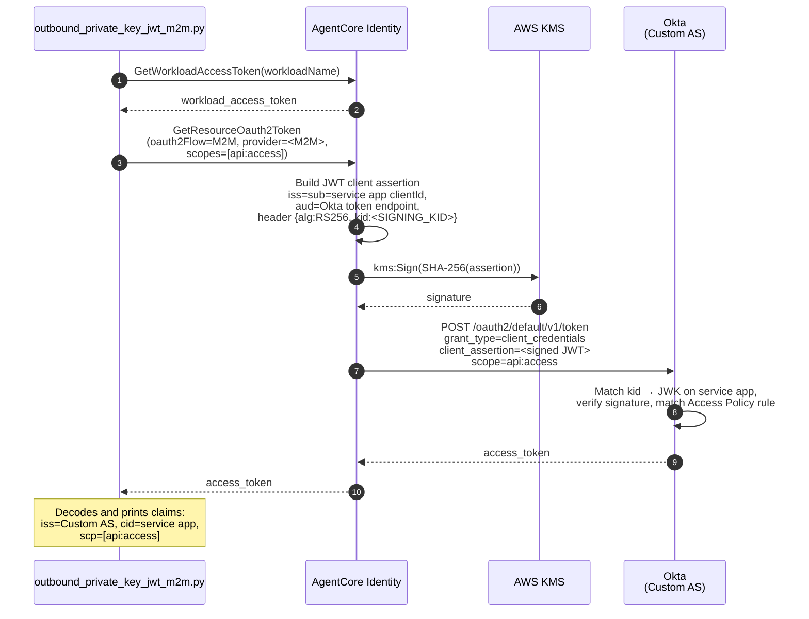
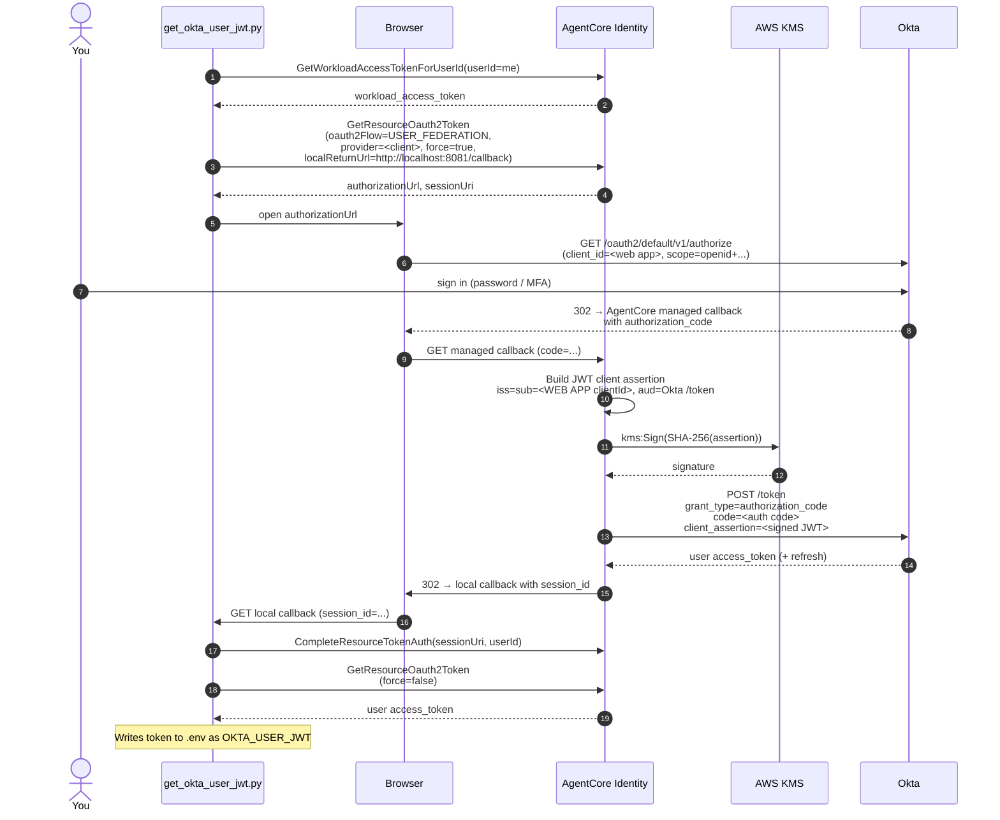
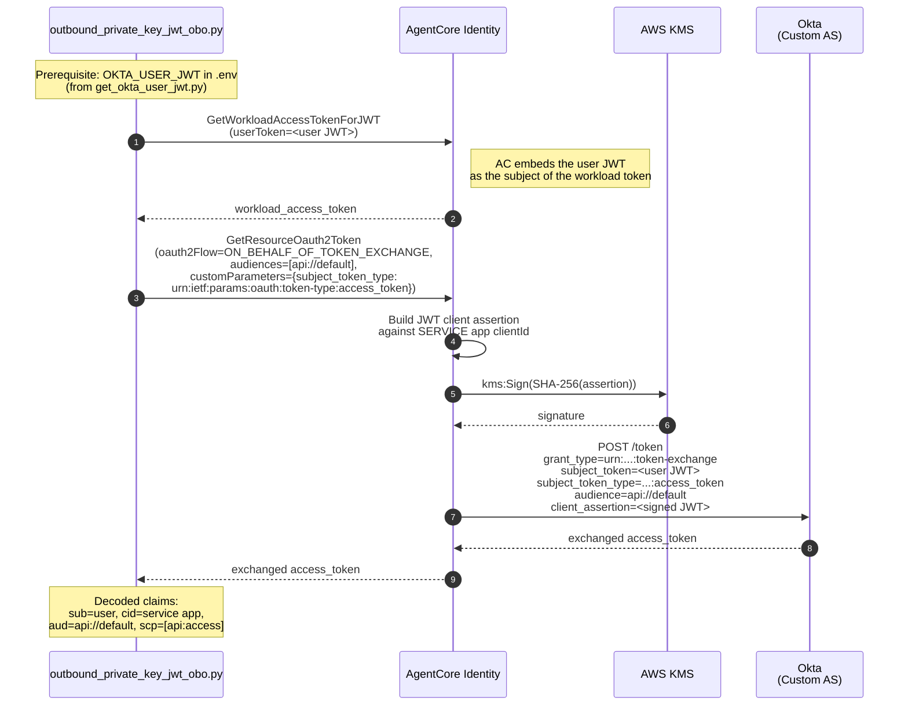

# PRIVATE_KEY_JWT with Okta

End-to-end walkthrough for AgentCore Identity's PRIVATE_KEY_JWT client
authentication against Okta, covering both:

- **M2M** (machine-to-machine): an agent obtaining its own tokens
  (`client_credentials`).
- **OBO** (on-behalf-of): an agent obtaining a token on behalf of an end
  user (RFC 8693 token exchange), including the browser three-legged
  OAuth (3LO) helper that
  mints the user's subject token in the first place.

Both flows use a single AWS Key Management Service (AWS KMS) asymmetric key to sign JWT client
assertions. No client secret is ever created, transmitted, or stored on
the AgentCore side.

| Property            | Value                                                            |
|:--------------------|:-----------------------------------------------------------------|
| Identity provider   | Okta (developer or enterprise org, Custom Authorization Server)  |
| Public-key format   | JSON Web Key (JWK), registered on the Okta app                   |
| Signing algorithm   | RS256 (Okta rejects PS256 for private_key_jwt)                   |
| KMS key spec        | RSA_2048, usage SIGN_VERIFY                                       |
| Grant flows shown   | client_credentials, authorization_code (3LO), token-exchange (OBO)|

## What this sample builds

Three AgentCore identity credential providers, two Okta apps, one
KMS-hosted signing key, and one workload identity, all wired
together so the three grant flows above share the same private key.

```
                          ┌──────────────────────────────┐
                          │  AWS KMS (RSA_2048)          │
                          │  alias: pkjwt-okta-sample-*  │
                          └──────────────┬───────────────┘
                                         │ kms:Sign (same key for all
                                         │ three provider configs)
        ┌────────────────┬───────────────┼───────────────┬────────────────┐
        │                │               │               │                │
  ┌─────┴───────┐  ┌─────┴──────┐  ┌─────┴──────┐        │                │
  │ M2M provider│  │ OBO provider│ │ Client prov.│  ┌────┴─────┐  ┌───────┴──────┐
  │ CustomOauth2│  │ CustomOauth2│ │ (3LO/authz) │  │ Okta     │  │ Okta login   │
  │ client_creds│  │ token-exch. │ │ authz_code  │  │ SERVICE  │  │ WEB app      │
  └─────┬───────┘  └─────┬──────┘  └─────┬──────┘  │ app      │  │              │
        │                │               │         │ JWK reg'd│  │ JWK reg'd    │
        └────────────────┴───────────────┼─────────┤ (kid=…)  │  │ (same kid)   │
                                         │         └──────────┘  └──────────────┘
                                         │
                                         ▼
                              ┌──────────────────────┐
                              │ Okta Custom AS       │
                              │ Access Policy + Rule │
                              │ (scope + grants)     │
                              └──────────────────────┘
```

Two Okta apps, one KMS key, one JWK:

- The **service app** (application_type=service) is the caller in M2M
  and the caller in OBO token exchange. Its client_id is the `cid` on
  every downstream token.
- The **web app** (application_type=web) is only used for user 3LO
  sign-in, the leg that produces the user JWT that OBO then exchanges.

They share the same KMS-signed JWK because the KMS key is what the
sample wants to demonstrate. Different Okta apps, one signing key.

## Which flow do I need?

| If you want to demonstrate...                                        | Run                                              |
|:---------------------------------------------------------------------|:-------------------------------------------------|
| Agent calling a downstream API as itself (M2M)                       | Setup 00, 01, 01a, 02 → demo M2M                 |
| Agent calling a downstream API on behalf of a user (OBO)             | All setup steps → get_okta_user_jwt → demo OBO   |

Everything below assumes the full OBO path. Skip 01b and 03b if you
only need M2M.

## Prerequisites

1. **Okta tenant**: developer or enterprise org where you can create
   applications. Note the app-facing domain (for example,
   `dev-12345678.okta.com`), never the admin host
   (`dev-12345678-admin.okta.com`).
2. **Okta admin API token (SSWS)**: optional. SSWS is Okta's
   proprietary HTTP authentication scheme for static API tokens; the
   token is sent in the `Authorization` header as `SSWS <token>`.
   Only needed for the automated setup path. Security → API → Tokens →
   Create Token; copy
   the token into `OKTA_API_TOKEN`. Skip this if you want to configure
   Okta by hand. See [Manual Okta configuration](#manual-okta-configuration-alternative-to-the-api-path)
   below.
3. **Custom Authorization Server.** The `default` Custom AS shipped
   with developer orgs works. Confirm it's present under Security →
   API → Authorization Servers.
4. **AWS credentials** with permission to call `kms`, `sts`, and
   `bedrock-agentcore-control`.
5. **Python 3.10+.**

## One-time setup

Run all commands from this sample's `okta/` folder.

```bash
cd 05-certificate-based-auth/okta

# Python environment
python3 -m venv .venv
source .venv/bin/activate         # macOS / Linux
# .venv\Scripts\activate          # Windows PowerShell
pip install --upgrade pip
pip install -r requirements.txt

# Configuration
cp config.example.env .env
# Now edit .env - see below.
```

### Configure `.env`

You have to set at minimum:

| Key                         | What it is                                                         |
|:----------------------------|:-------------------------------------------------------------------|
| `AWS_REGION`                | Region for the KMS key + AgentCore resources.                      |
| `OKTA_DOMAIN`               | App-facing Okta host (no `-admin.`).                               |
| `OKTA_AUTH_SERVER_ID`       | `default` unless you built a purpose-built Custom AS.              |
| `OKTA_API_TOKEN`            | SSWS admin token.                                                  |
| `OKTA_ASSIGN_USER_LOGIN`    | (OBO only) Okta login granted access to the web app for 3LO.       |

Everything else in `config.example.env` has sensible defaults. Setup
scripts write ids and ARNs back into `.env`. Leave those keys blank
so the scripts populate them.

### Run the setup pipeline

Each step is idempotent, prints a **Summary** block explaining what it
created, and tells you the exact next command.

```bash
# Step 0 - provision the KMS signing key + alias + key policy.
python setup/00_provision_signing_key.py

# Step 1 - create the Okta OIDC service app via Dynamic Client
# Registration. Registers the KMS public key as a JWK atomically.
python setup/01_create_okta_service_app.py

# Step 1a - configure the Custom AS: register the scope, create an
# Access Policy pointing at the service app, add a rule listing every
# grant type + scope this sample needs.
python setup/01a_configure_okta_auth_server.py

# ─── OBO-only branch (skip if you only want M2M) ───

# Step 1b - create the second Okta app (web) used by the browser
# 3LO flow. Same KMS-hosted JWK. Assigns your user, disables
# Federation Broker Mode (so explicit assignment works), and binds a
# permissive Authentication Policy to the app.
python setup/01b_create_okta_login_web_app.py

# ─── AgentCore identity providers ───

# Step 2 - M2M credential provider (client_credentials).
python setup/02_create_provider_m2m.py

# Step 3 - OBO credential provider (RFC 8693 token exchange).
python setup/03_create_provider_obo.py

# ─── OBO-only, cont. ───

# Step 3b - client credential provider for the USER_FEDERATION 3LO
# flow. Also wires AgentCore's managed callback URL onto the Okta
# web app's redirect_uris and adds your local callback URL to the
# workload identity's allowed list.
python setup/03b_create_provider_client.py
```

Each script terminates with a summary block similar to:

```
======================================================================
  Summary - step 01: Okta OIDC service app
======================================================================
  What was created (or reused if label already existed):
    Label           : AgentCore Identity Private Key JWT Sample
    App / client ID : <service-app-clientId>
    Application type: service
    Grant types     : client_credentials,
                      urn:ietf:params:oauth:grant-type:token-exchange
    Client auth     : private_key_jwt
    JWK kid         : <jwk-kid>  (RS256)

  Where to inspect it in the Okta admin console:
    Applications → Applications → search 'AgentCore Identity ...'
    General tab → Client Credentials should show:
      Client authentication : Public key / Private key
      Public Keys           : one JWK, kid = <jwk-kid>
    Direct URL:
      https://<domain>/admin/app/oidc_client/instance/<app-id>

  Written to .env:
    OKTA_SERVICE_APP_ID=<service-app-clientId>
    OKTA_SERVICE_APP_CLIENT_ID=<service-app-clientId>
    SIGNING_KID=<jwk-kid>

  Why this step matters:
    This is the confidential client that authenticates to Okta's
    /token endpoint on every M2M or OBO call. ...

  Next step:
    python setup/01a_configure_okta_auth_server.py
```

If a step prints a `✗` line and stops, read the Okta HTTP body it
prints. Every setup script surfaces Okta error responses so you don't
have to dig for them.

## Manual Okta configuration (alternative to the API path)

Everything above assumes an SSWS admin token: `setup/01`, `01a`, and
`01b` make Okta API calls to create the apps, scope, and policies.
If you'd rather do the Okta side by hand (or your admin won't hand out
an SSWS token), this section is for you.

### When you'd choose this path

- Your org's Okta admin controls app creation and won't grant you an
  SSWS token.
- You want to review every field before Okta writes it.
- You're demoing the sample in a shared tenant and can't script.

### How it works

1. Skip the Okta-API scripts. Everything else stays automated.

   | Step  | Automated path                                     | Manual path                                      |
   |:------|:---------------------------------------------------|:-------------------------------------------------|
   | 00    | `python setup/00_provision_signing_key.py` (KMS)   | same                                             |
   | 01    | `python setup/01_create_okta_service_app.py`       | Click through admin console (see helper below)   |
   | 01a   | `python setup/01a_configure_okta_auth_server.py`   | Click through admin console                       |
   | 01b   | `python setup/01b_create_okta_login_web_app.py`    | Click through admin console (OBO only)           |
   | 02    | `python setup/02_create_provider_m2m.py`           | same                                             |
   | 03    | `python setup/03_create_provider_obo.py`           | same                                             |
   | 03b   | `python setup/03b_create_provider_client.py`       | same, but with `OKTA_API_TOKEN` blank it prints the callback URL for you to paste manually |

2. Generate the click-by-click instructions:

   ```bash
   python setup/00_provision_signing_key.py       # still needed - KMS
   python setup/print_manual_okta_instructions.py # full walkthrough
   # or:
   python setup/print_manual_okta_instructions.py --m2m
   python setup/print_manual_okta_instructions.py --obo
   ```

   The helper reads your KMS key, derives the JWK, and prints:
   - The **exact JWK JSON** to paste as Public Key on each Okta app.
   - Step-by-step Okta admin console navigation with every field
     value the API path would have set.
   - Which `.env` keys to fill in after each screen.

3. After the console clicks, fill in `.env` by hand:

   ```
   OKTA_SERVICE_APP_ID=<client_id of the service app>
   OKTA_SERVICE_APP_CLIENT_ID=<same value>
   SIGNING_KID=<kid from the JWK block>

   # OBO-only
   OKTA_LOGIN_APP_ID=<client_id of the web app>
   OKTA_LOGIN_APP_CLIENT_ID=<same value>
   ```

   Leave `OKTA_API_TOKEN` blank.

4. Run the AgentCore-side scripts as usual:

   ```bash
   python setup/02_create_provider_m2m.py
   python setup/03_create_provider_obo.py
   python setup/03b_create_provider_client.py    # OBO only
   ```

   `setup/03b` sees that `OKTA_API_TOKEN` is blank and prints:

   ```
   → Manual Okta step required
     In the Okta admin console:
       Applications → Applications → your login web app → General tab
       LOGIN → General Settings → Edit → Sign-in redirect URIs
       → Add URI → paste:
           https://us-east-1...agent-credential-provider.../identities/oauth2/callback/<uuid>
       → Save.
   ```

   Paste that URL into the web app's Sign-in redirect URIs, then
   continue to the demos.

### What manual mode can't do for you

- **`cleanup.py`** still needs an SSWS token to sweep Okta. Without one
  it skips the Okta side entirely and only tears down AgentCore + KMS.
  Delete the apps + scope + policies by hand if you need a full reset.
- **`diagnose_login_app.py`** also needs an SSWS token; it's read-only
  but calls `/api/v1/apps/...` under the hood.

## Demo 1: M2M

```bash
python outbound_private_key_jwt_m2m.py
```

### Sequence



What the script does:

1. `GetWorkloadAccessToken`: a short-lived workload identity token
   that identifies this agent (not any end user).
2. `GetResourceOauth2Token(oauth2Flow=M2M, provider=<M2M provider>)`.
   AgentCore identity:
   - Builds a JWT client assertion: `iss=sub=<service-app client_id>`,
     `aud=<Okta token endpoint>`, `jti`, `iat`, `exp`, header
     `{alg:RS256, kid:<SIGNING_KID>}`.
   - Calls `kms:Sign` against your KMS key.
   - POSTs to Okta's `/token` with `grant_type=client_credentials`,
     `client_assertion`, and
     `client_assertion_type=urn:ietf:params:oauth:client-assertion-type:jwt-bearer`.
3. Prints the returned token and decoded claims.

**What a successful run looks like:**

```
======================================================================
  M2M access token retrieved via PRIVATE_KEY_JWT client assertion
======================================================================
  Preview: eyJraWQiOiJPc21RY...aFNVzbqbxw
  Decoded claims:
    iss   : https://<your-tenant>.okta.com/oauth2/default
            ↳ Okta issuer - the Custom AS URL
    aud   : api://default
            ↳ Audience - API this token is intended for
    cid   : <service-app-clientId>
            ↳ Client ID - the service app (also the caller identity)
    scp   : ['api:access']
    sub   : <service-app-clientId>
            ↳ Subject - for client_credentials, equals cid
    ...
```

Key invariants to confirm:

- `iss` is your Custom AS URL.
- `cid` is your **service app's** client_id from `.env`
  (`OKTA_SERVICE_APP_CLIENT_ID`).
- `scp` contains the scope you asked for (default `api:access`).

## Demo 2: Get a user JWT for OBO (browser 3LO)

OBO needs a user access token as its subject_token. This helper does
the AgentCore-mediated USER_FEDERATION flow:

```bash
python get_okta_user_jwt.py
```

### Sequence



Sequence:

1. `GetWorkloadAccessTokenForUserId`: workload token bound to `USER_ID_3LO`.
2. `GetResourceOauth2Token(oauth2Flow=USER_FEDERATION, forceAuthentication=true)`
   → AgentCore returns an authorization URL.
3. Your default browser opens Okta's authorize endpoint. Sign in with
   the login you set as `OKTA_ASSIGN_USER_LOGIN`.
4. Okta redirects to **AgentCore's managed callback URL**, which does
   the authorization_code exchange with Okta using PRIVATE_KEY_JWT
   (KMS-signed client assertion against your web app).
5. AgentCore stores the user tokens in its vault and redirects to
   your local callback URL with a `session_id`.
6. `CompleteResourceTokenAuth` binds the session to `USER_ID_3LO`.
7. A second `GetResourceOauth2Token` (`forceAuthentication=false`)
   fetches the stored access token.
8. Script writes the token to `.env` as `OKTA_USER_JWT`.

**What a successful run looks like:** the terminal prints
`Waiting for you to complete sign-in in the browser…`, opens Okta,
completes on your click of "Verify", and finishes with:

```
✓ Received user access token (length=1042)
======================================================================
  User access token issued by Okta
======================================================================
  Decoded claims:
    iss                : https://<your-tenant>.okta.com/oauth2/default
                         ↳ Okta issuer - the Custom AS URL
    cid                : <login-web-app-clientId>   ← Web app's client_id
                         ↳ Client ID - the Web app that requested this token
    sub                : khurpas@amazon.com
                         ↳ Subject - your Okta login (the end user)
    scp                : ['openid', 'profile', 'email', 'api:access']
    ...
```

Note that `cid` here is the **web app**, not the service app. That
distinction matters: the OBO exchange uses the service app's cid, but
this leg (the code-exchange after browser login) uses the web app's.

## Demo 3: OBO (RFC 8693 token exchange)

```bash
python outbound_private_key_jwt_obo.py
```

### Sequence



Sequence:

1. Reads `OKTA_USER_JWT` from `.env`.
2. `GetWorkloadAccessTokenForJWT` embeds the user JWT as the subject
   of a workload access token.
3. `GetResourceOauth2Token(oauth2Flow=ON_BEHALF_OF_TOKEN_EXCHANGE, provider=<OBO provider>)`.
   AgentCore identity:
   - Builds a JWT client assertion signed by KMS against the **service
     app's** client_id.
   - POSTs to Okta's `/token` with:
     - `grant_type=urn:ietf:params:oauth:grant-type:token-exchange`
     - `subject_token=<user JWT>`
     - `subject_token_type=urn:ietf:params:oauth:token-type:access_token`
     - `audience=api://default`
     - `client_assertion=<KMS-signed JWT>`
4. Prints the exchanged token and its claims.

**What a successful run looks like:**

```
======================================================================
  On-behalf-of token retrieved via PRIVATE_KEY_JWT client assertion
======================================================================
  Decoded claims:
    iss   : https://<your-tenant>.okta.com/oauth2/default
    aud   : api://default
    cid   : <service-app-clientId>
            ↳ Client ID - the SERVICE app (proves the caller is your agent)
    sub   : khurpas@amazon.com
            ↳ Subject - the END USER (proves 'on behalf of')
    uid   : 00u12w8wc9kziMrrE698
    scp   : ['api:access']
    ...
    act   : (not emitted - provider actorTokenContent=NONE)
```

Key invariant: `sub` is the user, `cid` is the service app. That's the
OBO shape: the downstream API can enforce user-level permissions
(`sub`) and still log which agent called it (`cid`).

## Verifying in the Okta admin console

If a demo misbehaves, use these entry points to confirm what actually
got created in your tenant:

| Artifact                    | Where to look                                                                        |
|:----------------------------|:--------------------------------------------------------------------------------------|
| Service app                 | Applications → Applications → AgentCore Identity Private Key JWT Sample.              |
| Web app (OBO)               | Applications → Applications → AgentCore Identity Private Key JWT Login App.           |
| JWK on either app           | The app's General tab → Client Credentials → Public Keys.                             |
| Custom scope                | Security → API → Authorization Servers → `default` → Scopes.                          |
| AS Access Policy + rule     | Security → API → Authorization Servers → `default` → Access Policies.                 |
| App Authentication Policy   | Security → Authentication Policies → AgentCore Identity Private Key JWT Sample Auth.  |
| User assignment on web app  | Web app → Assignments tab.                                                            |
| Failed auth events          | Reports → System Log → filter by app or event type `app.oauth2.as.*`.                 |

Every setup script prints a **Direct URL** in its Summary block for the
resource it just created. Copy-paste that instead of navigating the
menus.

## Diagnostic helper

If OBO 3LO fails and you're not sure whether the block is at
assignment, Federation Broker Mode, or the App Authentication Policy,
run:

```bash
python diagnose_login_app.py
```

It reports the current Okta-side state of the web app: metadata,
`implicitAssignment` setting, direct user assignments, group
assignments, bound Authentication Policy and its rules, registered
redirect_uris. Read the output before assuming anything about state.

## Troubleshooting

These are the failure modes this sample has surfaced during development.

### `no_matching_policy` at the token endpoint (M2M)

Okta system log: `app.oauth2.as.token.grant`, outcome
`FAILURE / no_matching_policy`.

Cause: the requested grant type isn't in your AS Access Policy rule's
`grantTypes.include`, or the service app's client_id isn't in the
policy's `clients.include`.

Fix: re-run `python setup/01a_configure_okta_auth_server.py`. Its
verify block prints every rule's grant types and scopes so you can
confirm the state after the update.

### "You are not allowed to access this app" at 3LO sign-in

Okta system log: `app.oauth2.as.authorize_failure`.

This one has several possible causes, in the order this sample handles
them:

1. **User not assigned to the web app.** Fixed by setting
   `OKTA_ASSIGN_USER_LOGIN` in `.env`; `setup/01b` explicitly assigns
   that user.
2. **Federation Broker Mode conflicting with explicit assignment.**
   Okta rejects `POST /apps/{id}/users` while `implicitAssignment=true`.
   `setup/01b` disables Federation Broker Mode first when
   `OKTA_ASSIGN_USER_LOGIN` is set.
3. **Restrictive Authentication Policy on the web app.** DCR-created
   apps get bound to a default Authentication Policy that often
   requires MFA factors your user hasn't enrolled. `setup/01b` creates
   a permissive policy (1FA / password) and binds the app to it.
4. **Requested scope not covered by any AS Access Policy rule.**
   The USER_FEDERATION flow requests
   `openid profile email api:access`. If your rule's `scopes.include`
   only lists `api:access`, the whole authorize call fails with the
   same user-facing message. `setup/01a` includes the standard OIDC
   scopes in the rule for exactly this reason.

Run `python diagnose_login_app.py` to inspect state before guessing at
which layer is the blocker.

### `HTTP 400` with `"name must be unique"` on scope creation

Cause: Okta sometimes returns 400 (not 409) for duplicate scope names.
`setup/01a` handles this: it lists scopes first and only POSTs when
the target scope isn't present. If you're seeing this error, you're on
an older version of `setup/01a`; pull the latest.

### `HTTP 400 E0000001 GroupAppAssignment` when assigning "Everyone"

Cause: some Okta tenants refuse the built-in `Everyone` group
assignment via API on DCR-created apps.

Fix: set `OKTA_ASSIGN_USER_LOGIN` in `.env` and re-run `setup/01b`.
Explicit user assignment works on every tenant.

### `OKTA_USER_JWT looks expired`

The user JWT is a normal Okta access token, usually 1 hour. Just
re-run `python get_okta_user_jwt.py`.

### Other tenant-level gotchas

- **`OKTA_DOMAIN` must be the app-facing host.** Not
  `dev-12345678-admin.okta.com`. Setup scripts refuse the admin host
  explicitly.
- **`OKTA_SERVICE_APP_ID` is the appId, not the client_id.** Both
  start with `0oa` but they're different resources.
- **PS256 doesn't work with Okta.** Okta rejects the assertion. This
  sample uses RS256. ES256 also works if you switch the KMS key spec
  to `ECC_NIST_P256`.
- **KMS key policy needs an AgentCore-scoped statement.** Otherwise
  `kms:Sign` at token-request time fails with `AccessDenied`. See the
  policy `setup/00_provision_signing_key.py` builds.

## Cleanup

One consolidated script tears down everything the setup pipeline
created, in the right order, and blanks the setup-populated keys in
`.env`. The KMS key is deliberately left in place by default (so
re-runs of `setup/00` are instant).

```bash
python cleanup.py               # normal cleanup, keeps KMS
python cleanup.py --dry-run     # preview what would be deleted
python cleanup.py --delete-kms  # also schedule the KMS key for deletion
python cleanup.py --keep-env    # don't blank .env values
```

What `cleanup.py` deletes:

- The three AgentCore credential providers (`CLIENT_PROVIDER_NAME`,
  `OBO_PROVIDER_NAME`, `M2M_PROVIDER_NAME`) and the workload identity.
- Both Okta apps, matched by **label**, so orphan apps from failed
  setup runs get swept too, not just the ones whose ids are in `.env`.
- Custom AS Access Policy (by name) and Custom AS scope (by name).
- The App Authentication Policy `setup/01b` bound to the web app.
- Setup-populated `.env` keys (KMS ARN kept by default).

After cleanup, re-run the full setup pipeline to rebuild from scratch.

## File reference

| File                                      | Role                                                                                     |
|:------------------------------------------|:-----------------------------------------------------------------------------------------|
| `setup/00_provision_signing_key.py`       | Create the KMS RSA_2048 key and its key policy.                                          |
| `setup/01_create_okta_service_app.py`     | Create the Okta OIDC service app via DCR; register the JWK atomically.                   |
| `setup/01a_configure_okta_auth_server.py` | Register the scope, create the AS Access Policy + rule.                                  |
| `setup/01b_create_okta_login_web_app.py`  | (OBO) Create the login web app, assign a user, bind a permissive Auth Policy.            |
| `setup/02_create_provider_m2m.py`         | Create the M2M CustomOauth2 provider.                                                     |
| `setup/03_create_provider_obo.py`         | Create the OBO CustomOauth2 provider (token-exchange grant).                              |
| `setup/03b_create_provider_client.py`     | (OBO) Create the USER_FEDERATION provider; wire callback URLs.                            |
| `setup/print_manual_okta_instructions.py` | Print a click-by-click walkthrough for configuring Okta by hand (no SSWS token needed).   |
| `get_okta_user_jwt.py`                    | (OBO) Browser 3LO via AgentCore → writes `OKTA_USER_JWT` to `.env`.                       |
| `outbound_private_key_jwt_m2m.py`         | Fetch an M2M access token.                                                                |
| `outbound_private_key_jwt_obo.py`         | Perform the RFC 8693 exchange with the user JWT.                                          |
| `diagnose_login_app.py`                   | Inspect the current Okta state of the web app (assignment, policy, redirect_uris).       |
| `cleanup.py`                              | Tear down everything this sample created (keeps KMS by default).                          |
| `tests/test_provider_config.py`           | Offline unit tests for the provider config builders.                                      |
