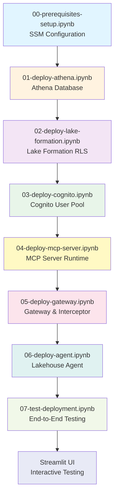

# Health Lakehouse Agent with Production-Grade Security

A complete lakehouse data processing system demonstrating Amazon Bedrock AgentCore capabilities with end-to-end OAuth authentication, enterprise-grade row-level security using AWS Lake Formation, and comprehensive data governance with SageMaker Unified Studio.

## Table of Contents

- [Overview](#overview)
- [Architecture](#architecture)
- [Key Features](#key-features)
- [Security Implementation](#security-implementation)
- [Prerequisites](#prerequisites)
- [Quick Start](#quick-start)
- [Configuration Guide](#configuration-guide)
- [Deployment Steps](#deployment-steps)
- [Testing](#testing)
- [Usage Examples](#usage-examples)
- [Troubleshooting](#troubleshooting)
- [File Structure](#file-structure)
- [Cost Estimate](#cost-estimate)

---

## Overview

This system showcases a production-ready lakehouse data processing application with:

- **Streamlit UI** with Cognito OAuth authentication
- **AI-Powered Lakehouse Agent** hosted on AgentCore Runtime using Strands framework
- **AgentCore Gateway** with policy-based tool access control
- **MCP Server** connecting to AWS Athena with Lake Formation row-level security
- **Lake Formation RLS** for enterprise-grade row-level security (infrastructure-level enforcement)
- **SageMaker Unified Studio** for data governance, cataloging, and discovery
- **OAuth credentials propagated** through the entire stack (UI → Agent → Gateway → Tool → Database)

### What Makes This Production-Ready

✅ **Infrastructure-Level Security**: Lake Formation enforces row-level security at the AWS query engine level, not in application code
✅ **Zero SQL Injection**: No SQL string interpolation with user input
✅ **Cannot Be Bypassed**: Security enforced by AWS, not application bugs
✅ **Full Audit Trail**: CloudTrail logs all data access with user identity
✅ **Compliance-Ready**: Meets HIPAA, SOC 2, and GDPR requirements
✅ **Data Governance**: Complete data cataloging, lineage tracking, and discovery

---

## Architecture

### High-Level Architecture

```
┌─────────────────────────────────────────────────────────────────┐
│                        User Layer                                │
│  ┌────────────────┐                                             │
│  │ Streamlit UI   │ OAuth login via Cognito                     │
│  │ + Cognito Auth │                                             │
│  └────────┬───────┘                                             │
└───────────┼─────────────────────────────────────────────────────┘
            │ Bearer Token (JWT with user identity)
            │
┌───────────▼─────────────────────────────────────────────────────┐
│                      AI Agent Layer                              │
│  ┌────────────────┐                                             │
│  │  Lakehouse Agent  │ Strands-based conversational agent          │
│  │ AgentCore      │ Natural language claim processing           │
│  │ Runtime        │                                             │
│  └────────┬───────┘                                             │
└───────────┼─────────────────────────────────────────────────────┘
            │ Bearer Token + Tool Request
            │
┌───────────▼─────────────────────────────────────────────────────┐
│                Gateway & Policy Layer                            │
│  ┌──────────────────────────────────────────────────────────┐  │
│  │  AgentCore Gateway + Interceptor Lambda                  │  │
│  │  - Validates JWT tokens                                  │  │
│  │  - Extracts user identity (email)                        │  │
│  │  - Enforces scope-based tool access                      │  │
│  │  - Adds user identity to request headers                 │  │
│  └────────┬───────────────────────────────────────────────────┘  │
└───────────┼─────────────────────────────────────────────────────┘
            │ User Identity + Tool Request
            │
┌───────────▼─────────────────────────────────────────────────────┐
│                    Tool Execution Layer                          │
│  ┌────────────────────────────────────────────────────────────┐ │
│  │  MCP Server (AgentCore Runtime)                            │ │
│  │  Athena connector with Lake Formation RLS                  │ │
│  │  - Receives user_id from Gateway                           │ │
│  │  - Assumes role with session tags                          │ │
│  │  - Executes queries with RLS enforcement                   │ │
│  └────────┬───────────────────────────────────────────────────┘ │
└───────────┼─────────────────────────────────────────────────────┘
            │ Athena Query with Session Tag
            │
┌───────────▼─────────────────────────────────────────────────────┐
│              Security & Governance Layer                         │
│                                                                  │
│  ┌────────────────────────┐    ┌──────────────────────────┐   │
│  │  Lake Formation        │    │ SageMaker Unified Studio │   │
│  │  (RLS Enforcement)     │    │ (Data Governance)        │   │
│  │                        │    │                          │   │
│  │ • Session tag-based    │    │ • Data catalog           │   │
│  │   access control       │    │ • Business glossary      │   │
│  │ • Row-level filters    │    │ • Data lineage           │   │
│  │ • user_id = tag        │    │ • Access workflows       │   │
│  │ • Query engine level   │    │ • Usage analytics        │   │
│  └────────┬───────────────┘    └───────────┬──────────────┘   │
│           │                                 │                   │
│           └──────────────┬──────────────────┘                   │
└──────────────────────────┼──────────────────────────────────────┘
                           │
┌──────────────────────────▼──────────────────────────────────────┐
│                       Data Layer                                 │
│  ┌──────────────────────────────────────────────────────────┐  │
│  │  AWS Athena + Glue Data Catalog                          │  │
│  │  • lakehouse_db database                          │  │
│  │  • claims table (with user_id for RLS)                   │  │
│  │  • users table (metadata)                                │  │
│  │  • Executes queries with Lake Formation filters          │  │
│  │  • S3 backend: s3://insurance-processor-rba/            │  │
│  └──────────────────────────────────────────────────────────┘  │
└─────────────────────────────────────────────────────────────────┘
```

### Data Flow Example: User Query

```
1. User Login
   Streamlit UI → Cognito → Returns JWT with user identity
   JWT contains: {
     "email": "user001@example.com",
     "scope": "lakehouse-api/claims/query"
   }

2. Query Submission
   User: "Show me all my pending claims"
   UI → Agent (with Bearer token)

3. Agent Processing
   Agent → Gateway (Bearer token + tool call request)

4. Gateway Interception
   Interceptor Lambda:
   - Validates JWT signature ✓
   - Checks token expiration ✓
   - Extracts user identity: "user001@example.com"
   - Validates scope: "claims/query" ✓
   - Adds header: X-User-Identity: user001@example.com

5. Tool Execution (Dual-Layer Security)

   a) Data Discovery (SageMaker Unified Studio):
      - User can discover "claims" dataset
      - View business glossary definitions
      - See data lineage

   b) Row-Level Security (Lake Formation):
      - MCP assumes IAM role with session tag: user_id=user001@example.com
      - Query: SELECT * FROM claims WHERE status = 'pending'
      - Lake Formation adds: AND user_id = '${aws:PrincipalTag/user_id}'
      - Final: ... WHERE status = 'pending' AND user_id = 'user001@example.com'

6. Athena Execution
   Athena executes filtered query → Returns only user001's claims

7. Response Flow
   Athena → MCP → Gateway → Agent → UI
   User sees only their pending claims
```

---

## Key Features

### Security Features

- **⭐ Enterprise Row-Level Security**: AWS Lake Formation enforces filtering at query engine level
- **🔒 Session Tag-Based Access Control**: User identity passed via IAM session tags (not SQL strings)
- **🛡️ SQL Injection Protection**: Zero SQL string interpolation - Lake Formation handles all filtering
- **📊 Fine-Grained Access Control**: JWT scopes determine which tools users can access
- **🔄 OAuth Token Propagation**: User identity flows through entire system
- **🔍 Full Audit Trail**: CloudTrail logs all data access with user identity

### Governance Features

- **📚 Data Catalog**: Searchable datasets with business context
- **📖 Business Glossary**: Healthcare term definitions (15+ terms)
- **🔗 Data Lineage**: Complete data flow visualization (S3 → Glue → Athena → MCP → Agent → UI)
- **🔐 Access Workflows**: Request and approval process
- **📊 Usage Analytics**: Track who accesses what data
- **🤝 Collaboration**: Share curated datasets

### Application Features

- **🏥 Health Insurance Operations**: Query, submit, update, and approve/deny claims
- **💬 Conversational AI**: Natural language interface for claims processing
- **☁️ Real Athena Integration**: Uses AWS Athena for scalable data queries
- **🎯 Multi-User Support**: Isolated data access per user

---

## Security Implementation

This implementation uses **AWS Lake Formation** with session tags for enterprise-grade row-level security.

### How Lake Formation RLS Works

```python
# Step 1: User Authentication
# User logs in → Cognito generates JWT with user identity

# Step 2: Identity Propagation
# JWT → Agent → Gateway → MCP Server receives user_id

# Step 3: MCP Server assumes IAM role with session tag
user_id = "user001@example.com"  # From Gateway header
credentials = sts.assume_role(
    RoleArn='arn:aws:iam::ACCOUNT:role/claims-rls-role',
    RoleSessionName='claims-query-user001',
    Tags=[
        {'Key': 'user_id', 'Value': user_id}
    ]
)

# Step 4: Lake Formation data filter is configured
# Table: lakehouse_db.claims
# Row Filter: user_id = '${aws:PrincipalTag/user_id}'

# Step 5: User query submitted (NO user_id in WHERE clause!)
query = "SELECT * FROM claims WHERE status = 'pending'"

# Step 6: Lake Formation automatically transforms to:
# SELECT * FROM claims
# WHERE status = 'pending'
# AND user_id = 'user001@example.com'  ← Added by Lake Formation

# Step 7: Athena executes filtered query
# Returns only rows where user_id matches session tag
```

### Security Guarantees

✅ **Cannot Access Other Users' Data**: Even if developer makes mistake, Lake Formation enforces filter
✅ **No SQL Injection**: User identity validated by IAM (not SQL)
✅ **Cannot Bypass**: Security enforced at AWS infrastructure level
✅ **Full Audit Trail**: CloudTrail logs all access with user identity
✅ **Compliance-Ready**: Meets HIPAA, SOC 2, GDPR requirements

### OAuth Scopes

| Scope | Description | Allows |
|-------|-------------|--------|
| `claims/query` | Read claims | query_claims, get_claim_details, get_claims_summary |
| `claims/submit` | Submit claims | submit_claim |
| `claims/update` | Update claims | update_claim_status |
| `claims/approve` | Approve/deny claims | update_claim_status (approval/denial) |

---

## Prerequisites

### AWS Account Setup

1. **AWS Account**:
   - AWS Account ID (e.g., XXXXXXXXXXXX)
   - Region: us-east-1 (configurable)

2. **AWS Permissions**:
   ```
   - BedrockAgentCoreFullAccess
   - AmazonBedrockFullAccess
   - AmazonAthenaFullAccess
   - AmazonS3FullAccess
   - AWSLambdaFullAccess
   - AmazonCognitoPowerUser
   - AWSLakeFormationDataAdmin
   - AmazonSageMakerFullAccess (for Unified Studio)
   ```

3. **AWS Services Enabled**:
   - Amazon Bedrock (with Claude Sonnet 4.5 access)
   - Amazon Bedrock AgentCore
   - AWS Lambda
   - Amazon Cognito
   - AWS Lake Formation
   - Amazon SageMaker
   - AWS Athena
   - AWS Glue
   - Amazon S3

### Development Environment

```bash
# Python 3.10 or later
python --version

# AWS CLI configured
aws configure

# Install dependencies
pip install -r requirements.txt
```

### Python Dependencies

```
boto3>=1.34.0
bedrock-agentcore>=1.0.0
strands-agents>=1.0.0
python-dotenv>=1.0.0
streamlit>=1.30.0
mcp>=1.9.0
python-jose[cryptography]>=3.4.0
pyarrow>=14.0.0
pandas>=2.0.0
sagemaker>=2.200.0
```

---

## Deployment Overview

### Deployment Notebooks

This project uses **Jupyter notebooks** for deployment. Each notebook is numbered to indicate the execution order and includes:
- Prerequisites check
- Step-by-step instructions
- Automated deployment commands
- Configuration saving to SSM
- Next steps guidance

### Notebook Execution Order

```
00-prerequisites-setup.ipynb     ← Start here
    ↓
01-deploy-athena.ipynb          (Data Layer)
    ↓
02-deploy-lake-formation.ipynb  (Security Layer)
    ↓
03-deploy-cognito.ipynb         (Identity Layer)
    ↓
04-deploy-mcp-server.ipynb      (Tool Layer)
    ↓
05-deploy-gateway.ipynb         (Gateway Layer)
    ↓
06-deploy-agent.ipynb           (Agent Layer)
    ↓
07-test-deployment.ipynb        (Testing)
    ↓
streamlit-ui/streamlit_app.py   (UI - run manually)
```

### Dependency Diagram



### Quick Start

**Step 1: Open and run the notebooks in order**

```bash
# Start with prerequisites
jupyter notebook 00-prerequisites-setup.ipynb

# Then run each deployment notebook in sequence
# 01 → 02 → 03 → 04 → 05 → 06 → 07
```

**Step 2: Launch Streamlit UI**

```bash
cd streamlit-ui
streamlit run streamlit_app.py
```

### Estimated Time

| Notebook | Duration | Description |
|----------|----------|-------------|
| 00-prerequisites | 10 min | SSM configuration |
| 01-athena | 15 min | Database setup |
| 02-lake-formation | 20 min | RLS configuration |
| 03-cognito | 15 min | User authentication |
| 04-mcp-server | 30 min | MCP server deployment |
| 05-gateway | 25 min | Gateway & interceptor |
| 06-agent | 30 min | Agent deployment |
| 07-test | 15 min | Testing |
| **Total** | **~2.5 hours** | Complete deployment |

---

## Detailed Deployment Steps

### Step 1: Configure Environment with SSM

**📓 Notebook**: `00-prerequisites-setup.ipynb`

This notebook configures AWS Systems Manager (SSM) Parameter Store with initial configuration values.

**What it does:**
- Validates AWS credentials
- Creates SSM parameters with `lh_` prefix
- Auto-detects AWS Account ID and Region
- Validates configuration

**Next**: Run `01-deploy-athena.ipynb`

---

### Step 2: Deploy Athena Database

**📓 Notebook**: `01-deploy-athena.ipynb`

Creates the Athena database and tables for the lakehouse data layer.

**What it creates:**
- Database: `lakehouse_db`
- Table: `claims` (with 9 sample claims)
- Table: `users` (with 3 test users)

**Next**: Run `02-deploy-lake-formation.ipynb`

---

### Step 3: Deploy Lake Formation RLS

**📓 Notebook**: `02-deploy-lake-formation.ipynb`

Sets up enterprise-grade row-level security using AWS Lake Formation.

**What it creates:**
- IAM role: `lakehouse-rls-role`
- Data filter: `user_id = '${aws:PrincipalTag/user_id}'`
- Lake Formation permissions

**Next**: Run `03-deploy-cognito.ipynb`

---

### Step 4: Deploy Cognito

**📓 Notebook**: `03-deploy-cognito.ipynb`

Sets up user authentication with AWS Cognito.

**What it creates:**
- User Pool with OAuth configuration
- App client with scopes
- Test users (user001@example.com, user002@example.com, adjuster001@example.com)
- Password: TempPass123!

**Next**: Run `04-deploy-mcp-server.ipynb`

---

### Step 5: Deploy MCP Server

**📓 Notebook**: `04-deploy-mcp-server.ipynb`

Deploys the MCP Server to AgentCore Runtime.

**What it does:**
- Builds Docker container with MCP server
- Deploys to AgentCore Runtime
- Configures Lake Formation RLS integration
- Saves Runtime ARN to SSM

**Requirements**: Docker must be installed and running

**Next**: Run `05-deploy-gateway.ipynb`

---

### Step 6: Deploy Gateway & Interceptor

**📓 Notebook**: `05-deploy-gateway.ipynb`

Deploys the AgentCore Gateway and Interceptor Lambda.

**What it creates:**
- Interceptor Lambda (JWT validation)
- AgentCore Gateway (routing and policy enforcement)

**OAuth Flow**: Streamlit → Agent → Gateway → Interceptor → MCP Server → Lake Formation

**Next**: Run `06-deploy-agent.ipynb`

---

### Step 7: Deploy Lakehouse Agent

**📓 Notebook**: `06-deploy-agent.ipynb`

Deploys the Lakehouse Agent to AgentCore Runtime.

**What it does:**
- Builds Docker container with agent code
- Deploys to AgentCore Runtime
- Configures Gateway integration
- Saves Agent Runtime ARN to SSM

**Requirements**: Docker must be installed and running

**Next**: Run `07-test-deployment.ipynb`

---

### Step 8: Test Deployment

**📓 Notebook**: `07-test-deployment.ipynb`

Tests the complete lakehouse agent system end-to-end.

**What it tests:**
- OAuth token generation from Cognito
- Agent invocation with bearer token
- End-to-end request flow
- CloudWatch logs verification

**Next**: Run Streamlit UI for interactive testing

---

### Step 9: Run Streamlit UI

Launch the Streamlit interface for interactive testing:

```bash
cd streamlit-ui
streamlit run streamlit_app.py
```

Open http://localhost:8501 in your browser.

**Test with different users:**
- user001@example.com / TempPass123! (sees 4 claims)
- user002@example.com / TempPass123! (sees 5 claims)
- adjuster001@example.com / TempPass123!

**Verify Row-Level Security**: Each user should see only their own claims.

---

### Step 7: Deploy Gateway & Interceptor

The AgentCore Gateway acts as a secure proxy between the AI agent and the MCP server. The Interceptor Lambda validates OAuth tokens and enforces scope-based access control.

**What the Interceptor does**:
- Extracts JWT bearer tokens from MCP gateway request structure
- Validates JWT tokens against Cognito (signature, expiration, audience, issuer)
- Extracts user principal (email/username) from JWT claims
- Adds `X-User-Identity` header to requests for downstream MCP server
- Returns responses in proper MCP interceptor format
- Follows AgentCore Gateway MCP protocol

**What the Gateway does**:
- Routes tool requests from agent to MCP server
- Wraps requests in MCP structure before invoking interceptor
- Applies interceptor for authentication/authorization
- Enforces policy-based access control
- Provides observability and logging

**⭐ Recent Update**: The interceptor has been updated to follow the proper AgentCore Gateway MCP protocol for extracting JWT tokens and user principals. See `gateway-setup/INTERCEPTOR_UPDATE.md` for details.

#### Deploy the Interceptor Lambda

```bash
cd ../gateway-setup/interceptor

# Package and deploy interceptor Lambda (handles role creation, packaging, and deployment)
bash deploy.sh
```

The `deploy.sh` script will:
1. Load configuration from SSM Parameter Store via config module
2. Create Lambda execution role (if not exists)
3. Package Lambda function with dependencies (including python-jose for JWT validation)
4. Create or update Lambda function with proper configuration

**Configuration Used** (from SSM Parameter Store):
- `lh_cognito_region`: AWS region where Cognito User Pool is located (or uses AWS_REGION)
- `lh_cognito_user_pool_id`: User Pool ID from Step 5
- `lh_cognito_app_client_id`: App Client ID from Step 5

**Required IAM Role Permissions**:
The Lambda execution role includes:
- `AWSLambdaBasicExecutionRole` - CloudWatch logging
- No additional permissions needed (validates JWT locally using Cognito public keys)

**The script outputs the Interceptor Lambda ARN** - this will be used in the next step.

#### Create the AgentCore Gateway

```bash
# Navigate back to gateway-setup directory
cd ..

# Get AWS region from session
AWS_REGION=$(aws configure get region)

# Get the Interceptor Lambda ARN
INTERCEPTOR_ARN=$(aws lambda get-function --function-name lakehouse-gateway-interceptor --region $AWS_REGION --query 'Configuration.FunctionArn' --output text)

# Get MCP Server Runtime ARN from SSM
MCP_SERVER_RUNTIME_ARN=$(aws ssm get-parameter --name lh_mcp_server_runtime_arn --query 'Parameter.Value' --output text)

# Get Cognito User Pool ARN from SSM
COGNITO_USER_POOL_ID=$(aws ssm get-parameter --name lh_cognito_user_pool_id --query 'Parameter.Value' --output text)
COGNITO_USER_POOL_ARN="arn:aws:cognito-idp:${AWS_REGION}:$(aws sts get-caller-identity --query Account --output text):userpool/${COGNITO_USER_POOL_ID}"

# Create gateway with interceptor and MCP server runtime
python create_gateway.py \
  --gateway-name lakehouse-gateway \
  --mcp-server-runtime-arn $MCP_SERVER_RUNTIME_ARN \
  --interceptor-arn $INTERCEPTOR_ARN \
  --cognito-user-pool-arn $COGNITO_USER_POOL_ARN
```

**Gateway Configuration**:
- **Name**: lakehouse-gateway
- **MCP Server**: AgentCore Runtime ARN from Step 6
- **Interceptor**: Lambda ARN from above
- **Auth**: Cognito User Pool ARN from Step 5

#### OAuth Token Flow Through the System

The complete OAuth token flow follows the AgentCore Gateway MCP protocol:

```
1. Streamlit UI
   - User authenticates with Cognito
   - Gets OAuth2 access token (client_credentials flow)
   - Passes token in payload: {"bearer_token": "<token>"}
   ↓
2. Lakehouse Agent
   - Receives bearer_token from payload
   - Creates MCP client with Authorization header
   - Sends to Gateway: {"Authorization": "Bearer <token>"}
   ↓
3. AgentCore Gateway
   - Receives request with Authorization header
   - Wraps in MCP structure:
     {
       "mcp": {
         "gatewayRequest": {
           "headers": {"Authorization": "Bearer <token>"},
           "body": {...}
         }
       }
     }
   - Invokes Interceptor Lambda
   ↓
4. Gateway Interceptor (⭐ UPDATED)
   - Extracts token from event['mcp']['gatewayRequest']['headers']
   - Validates JWT against Cognito public keys
   - Extracts user principal (email/username) from claims
   - Adds X-User-Identity header
   - Returns transformed request in MCP format:
     {
       "interceptorOutputVersion": "1.0",
       "mcp": {
         "transformedGatewayRequest": {
           "headers": {"X-User-Identity": "user@example.com"},
           "body": {...}
         }
       }
     }
   ↓
5. Gateway → MCP Server
   - Forwards request with X-User-Identity header
   ↓
6. MCP Server
   - Extracts user principal from X-User-Identity header
   - Assumes IAM role with session tag (user_id)
   ↓
7. Lake Formation
   - Enforces row filter based on session tag
   - Returns only user's own data
```

**Reference Documentation**:
- See `gateway-setup/INTERCEPTOR_UPDATE.md` for detailed changes
- See `gateway-setup/OAUTH_FLOW_DIAGRAM.md` for visual diagrams
- Reference: [AWS AgentCore Gateway Token Exchange](https://github.com/awslabs/amazon-bedrock-agentcore-samples/blob/main/01-tutorials/02-AgentCore-gateway/14-token-exchange-at-request-interceptor/)

**Save `GATEWAY_ARN` to SSM Parameter Store**:
```bash
aws ssm put-parameter --name "lh_gateway_arn" --value "arn:aws:bedrock-agentcore:us-east-1:ACCOUNT:gateway/gateway-id" --type "String"
aws ssm put-parameter --name "lh_gateway_id" --value "gateway-id" --type "String"
```

#### Verify Interceptor Deployment

Check CloudWatch Logs to verify the interceptor is working correctly:

```bash
# Tail interceptor logs
aws logs tail /aws/lambda/lakehouse-gateway-interceptor --follow

# Look for these log messages:
# ✅ Bearer token extracted from MCP gateway request
# ✅ Extracted user principal: user@example.com
# ✅ Request authorized for user: user@example.com
# 📤 Returning transformed request
```

### Step 8: Deploy Lakehouse Agent

```bash
cd ../lakehouse-agent

# Deploy the agent to AgentCore Runtime
python deploy_lakehouse_agent.py
```

The deployment script will:
1. Create IAM role for the agent runtime with necessary permissions (Bedrock, Gateway access, CloudWatch logs)
2. Use the Bedrock AgentCore Starter Toolkit to build a Docker container
3. Deploy the containerized agent to AgentCore Runtime
4. Automatically save the runtime configuration to SSM Parameter Store

**What happens during deployment**:
- Docker builds a container image with your agent code and dependencies
- Image is pushed to Amazon ECR (Elastic Container Registry)
- AgentCore Runtime is created and configured
- Agent is ready to receive requests

**Configuration saved automatically**:
- `lh_lakehouse_agent_runtime_id`: Runtime identifier
- `LAKEHOUSE_AGENT_RUNTIME_ARN`: Full ARN of the runtime
- `LAKEHOUSE_AGENT_NAME`: Agent name (lakehouse_agent)

**Note**: This deployment uses Docker, so ensure Docker is running on your machine.

### Step 9: Run Streamlit UI

```bash
cd ../streamlit-ui

streamlit run streamlit_app.py
```

Open http://localhost:8501 in your browser.

### Step 10: Test the System

```
1. Login with: user001@example.com / TempPass123!
2. Query: "Show me all my claims"
3. Verify: Only sees 4 claims (their own)
4. Login with: user002@example.com / TempPass123!
5. Query: "Show me all my claims"
6. Verify: Only sees 5 claims (their own)
```

---

## Configuration Guide

### Configuration Management with AWS Systems Manager (SSM)

**⚠️ IMPORTANT**: This application now uses AWS Systems Manager (SSM) Parameter Store for configuration management instead of `.env` files. This provides enhanced security, centralized configuration, and better support for production deployments.

#### Why SSM Parameter Store?

✅ **Enhanced Security**: Sensitive values stored as encrypted SecureString parameters
✅ **Centralized Management**: Single source of truth for all environments
✅ **No Local Files**: No `.env` files to manage or accidentally commit
✅ **Audit Trail**: CloudTrail logs all parameter access
✅ **IAM-Based Access**: Fine-grained permissions control
✅ **Auto-Detection**: AWS_REGION and AWS_ACCOUNT_ID automatically detected

#### SSM Parameter Naming Convention

All lakehouse-agent parameters use the `lh_` prefix for easy identification and management:

| Config Key | SSM Parameter Name | Type | Example Value |
|------------|-------------------|------|---------------|
| S3_BUCKET_NAME | lh_s3_bucket_name | String | insurance-processor-rba |
| COGNITO_USER_POOL_ID | lh_cognito_user_pool_id | String | us-east-1_XXXXXXXXX |
| COGNITO_APP_CLIENT_SECRET | lh_cognito_app_client_secret | SecureString | (encrypted) |
| RLS_ROLE_ARN | lh_rls_role_arn | String | arn:aws:iam::... |
| GATEWAY_ARN | lh_gateway_arn | String | arn:aws:bedrock-agentcore:... |

**Naming Rules**:
- All parameters start with `lh_` prefix
- Config keys converted to lowercase
- Underscores preserved
- Example: `COGNITO_USER_POOL_ID` → `lh_cognito_user_pool_id`

**Special Cases** (Auto-Detected, NOT stored in SSM):
- `AWS_REGION`: Retrieved from boto3 session (respects AWS_DEFAULT_REGION environment variable)
- `AWS_ACCOUNT_ID`: Retrieved from STS GetCallerIdentity API call

#### Setting SSM Parameters

**Using AWS CLI**:
```bash
# Set a regular parameter
aws ssm put-parameter \
  --name "lh_s3_bucket_name" \
  --value "insurance-processor-rba" \
  --type "String" \
  --description "S3 bucket for lakehouse data"

# Set a sensitive parameter (encrypted)
aws ssm put-parameter \
  --name "lh_cognito_app_client_secret" \
  --value "your-secret-here" \
  --type "SecureString" \
  --description "Cognito app client secret"

# Update an existing parameter
aws ssm put-parameter \
  --name "lh_gateway_arn" \
  --value "arn:aws:bedrock-agentcore:us-east-1:XXXXXXXXXXXX:gateway/abc123" \
  --type "String" \
  --overwrite
```

**Using AWS Console**:
1. Navigate to AWS Systems Manager → Parameter Store
2. Click "Create parameter"
3. Name: `lh_s3_bucket_name` (must start with `lh_`)
4. Type: `String` or `SecureString` (for sensitive values)
5. Value: Your configuration value
6. Click "Create parameter"

#### Migration from .env to SSM

If you have an existing `.env` file, use the migration utility to transfer values to SSM:

```bash
# Preview what will be migrated (dry-run)
python ssm_migrate.py migrate --env-file .env --dry-run

# Migrate all parameters to SSM
python ssm_migrate.py migrate --env-file .env

# Force overwrite existing parameters (use with caution)
python ssm_migrate.py migrate --env-file .env --force
```

**Migration Process**:
1. Reads all KEY=VALUE pairs from `.env` file
2. Converts keys to SSM parameter names (adds `lh_` prefix, lowercase)
3. Detects sensitive parameters (SECRET, PASSWORD, KEY in name)
4. Creates SecureString for sensitive values, String for others
5. Skips AWS_REGION and AWS_ACCOUNT_ID (auto-detected)
6. Prompts before overwriting existing parameters (unless --force)
7. Displays summary of created/updated/skipped parameters

**Example Output**:
```
🔄 Migrating .env to SSM Parameter Store...

✅ Created lh_s3_bucket_name (String)
✅ Created lh_cognito_user_pool_id (String)
✅ Created lh_cognito_app_client_secret (SecureString)
⏭️  Skipped lh_gateway_arn (already exists, use --force to overwrite)
⏭️  Skipped AWS_REGION (auto-detected from boto3 session)
⏭️  Skipped AWS_ACCOUNT_ID (auto-detected from STS)

📊 Migration Summary:
   Created: 15 parameters
   Updated: 0 parameters
   Skipped: 3 parameters
   Failed: 0 parameters
```

#### Exporting SSM Parameters (Backup)

Export current SSM parameters to a file for backup or documentation:

```bash
# Export to file (sensitive values masked)
python ssm_migrate.py export --output backup.env

# Export with decrypted secrets (use with caution)
python ssm_migrate.py export --output backup.env --include-secrets
```

#### Validating SSM Configuration

Check that all required parameters are set in SSM:

```bash
# Validate all required parameters exist
python ssm_migrate.py validate

# Verbose output with parameter details
python ssm_migrate.py validate --verbose
```

**Example Output**:
```
✅ Validating SSM parameters...

✅ lh_s3_bucket_name: insurance-processor-rba
✅ lh_cognito_user_pool_id: us-east-1_XXXXXXXXX
✅ lh_cognito_app_client_secret: ****** (SecureString)
✅ lh_rls_role_arn: arn:aws:iam::XXXXXXXXXXXX:role/lakehouse-rls-role
❌ lh_gateway_arn: NOT FOUND

⚠️  Missing 1 required parameter(s)
```

#### Required IAM Permissions

**📁 Pre-built Policy Templates Available**: See `iam-policies/` directory for ready-to-use JSON policy files.

**For Application Runtime** (read-only access):
```json
{
  "Version": "2012-10-17",
  "Statement": [
    {
      "Effect": "Allow",
      "Action": [
        "ssm:GetParameter",
        "ssm:GetParametersByPath"
      ],
      "Resource": "arn:aws:ssm:*:*:parameter/lh_*"
    },
    {
      "Effect": "Allow",
      "Action": ["kms:Decrypt"],
      "Resource": "arn:aws:kms:*:*:key/*",
      "Condition": {
        "StringEquals": {
          "kms:ViaService": "ssm.*.amazonaws.com"
        }
      }
    },
    {
      "Effect": "Allow",
      "Action": ["sts:GetCallerIdentity"],
      "Resource": "*"
    }
  ]
}
```

**For Migration/Management** (read-write access):
```json
{
  "Version": "2012-10-17",
  "Statement": [
    {
      "Effect": "Allow",
      "Action": [
        "ssm:PutParameter",
        "ssm:GetParameter",
        "ssm:GetParametersByPath",
        "ssm:DescribeParameters"
      ],
      "Resource": "arn:aws:ssm:*:*:parameter/lh_*"
    },
    {
      "Effect": "Allow",
      "Action": ["kms:Decrypt"],
      "Resource": "arn:aws:kms:*:*:key/*",
      "Condition": {
        "StringEquals": {
          "kms:ViaService": "ssm.*.amazonaws.com"
        }
      }
    },
    {
      "Effect": "Allow",
      "Action": ["sts:GetCallerIdentity"],
      "Resource": "*"
    }
  ]
}
```

**Attaching Policies**:
```bash
# Create policy from JSON file
aws iam create-policy \
  --policy-name LakehouseSSMReadPolicy \
  --policy-document file://iam-policies/lakehouse-ssm-read-policy.json

# Attach to role
aws iam attach-role-policy \
  --role-name YourLambdaExecutionRole \
  --policy-arn arn:aws:iam::XXXXXXXXXXXX:policy/LakehouseSSMReadPolicy
```

**📖 Detailed Instructions**: See `iam-policies/README.md` for:
- Step-by-step policy creation
- Policy customization options
- Testing and troubleshooting
- Security best practices

#### AWS Region and Account ID Auto-Detection

The application automatically detects AWS_REGION and AWS_ACCOUNT_ID:

**AWS_REGION Detection**:
1. Checks boto3 session default region
2. Falls back to AWS_DEFAULT_REGION environment variable
3. Falls back to us-east-1 if not set

**AWS_ACCOUNT_ID Detection**:
1. Calls STS GetCallerIdentity API
2. Extracts account ID from response
3. Caches for session lifetime

**Benefits**:
- No need to store these values in SSM
- Automatically works across different AWS accounts
- Simplifies multi-account deployments
- Reduces configuration errors

**Usage in Code**:
```python
from config import config

# These are auto-detected
region = config.AWS_REGION        # From boto3 session
account_id = config.AWS_ACCOUNT_ID  # From STS

# ARNs with substitution work automatically
role_arn = config.RLS_ROLE_ARN  # arn:aws:iam::${AWS_ACCOUNT_ID}:role/...
# Becomes: arn:aws:iam::XXXXXXXXXXXX:role/...
```

#### Troubleshooting SSM Configuration

**Issue: "SSM Parameter Store unavailable: AccessDeniedException"**

**Cause**: Insufficient IAM permissions

**Solution**:
1. Check your AWS credentials: `aws sts get-caller-identity`
2. Verify IAM permissions include `ssm:GetParameter` and `ssm:GetParametersByPath`
3. For SecureString parameters, ensure `kms:Decrypt` permission
4. Attach the appropriate IAM policy (see Required IAM Permissions above)

---

**Issue: "Missing required configuration parameters"**

**Cause**: Required parameters not set in SSM

**Solution**:
1. Run validation: `python ssm_migrate.py validate`
2. Check which parameters are missing
3. Set missing parameters using AWS CLI or Console
4. Verify parameter names start with `lh_` prefix

---

**Issue: "Cannot decrypt SecureString parameter"**

**Cause**: Missing KMS decrypt permission

**Solution**:
1. Add KMS decrypt permission to IAM role
2. Ensure condition allows SSM service: `"kms:ViaService": "ssm.*.amazonaws.com"`
3. Verify KMS key policy allows your role to decrypt

---

**Issue: "Parameter not found: lh_gateway_arn"**

**Cause**: Parameter name mismatch or not created

**Solution**:
1. List all lh_* parameters: `aws ssm get-parameters-by-path --path /lh_ --recursive`
2. Check parameter name matches convention (lowercase, lh_ prefix)
3. Create missing parameter: `aws ssm put-parameter --name lh_gateway_arn --value "..." --type String`

---

**Issue: "Region detection failed"**

**Cause**: No default region configured

**Solution**:
1. Set AWS_DEFAULT_REGION environment variable: `export AWS_DEFAULT_REGION=us-east-1`
2. Or configure AWS CLI: `aws configure set region us-east-1`
3. Or pass region explicitly when creating boto3 session

---

**Issue: "Account ID detection failed"**

**Cause**: STS GetCallerIdentity permission denied

**Solution**:
1. Add STS permission to IAM role: `"sts:GetCallerIdentity"`
2. Verify AWS credentials are valid: `aws sts get-caller-identity`
3. Check network connectivity to STS endpoint

---

**Issue: "Migration utility fails with 'Rate exceeded'"**

**Cause**: AWS API rate limits

**Solution**:
1. The utility automatically retries with exponential backoff
2. For large migrations, use smaller batches
3. Wait a few minutes and retry

---

**Issue: "Parameter exists but shows as missing"**

**Cause**: Parameter name case mismatch

**Solution**:
1. SSM parameter names are case-sensitive
2. Ensure all parameters use lowercase: `lh_s3_bucket_name` not `lh_S3_BUCKET_NAME`
3. Delete incorrect parameter and recreate with correct name

---

**Debug Commands**:
```bash
# List all lakehouse parameters
aws ssm get-parameters-by-path --path / --recursive | grep "lh_"

# Get specific parameter
aws ssm get-parameter --name lh_s3_bucket_name

# Get parameter with decryption
aws ssm get-parameter --name lh_cognito_app_client_secret --with-decryption

# Check IAM permissions
aws iam get-role-policy --role-name YourRole --policy-name YourPolicy

# Test STS access
aws sts get-caller-identity

# View CloudWatch logs for SSM access
aws logs tail /aws/lambda/your-function --follow | grep SSM
```

### Environment Variables (Legacy - For Reference Only)

**⚠️ DEPRECATED**: The application no longer uses `.env` files. This section is kept for reference only.

All configuration is now managed through SSM Parameter Store (see above):

```bash
# ========================================
# AWS Configuration
# ========================================
AWS_REGION=us-east-1
AWS_ACCOUNT_ID=XXXXXXXXXXXX  # Set once - auto-substitutes in ARNs!

# ========================================
# S3 Configuration
# ========================================
S3_BUCKET_NAME=insurance-processor-rba
S3_CLAIMS_PREFIX=lakehouse-data/claims/
S3_USERS_PREFIX=lakehouse-data/users/
S3_ATHENA_RESULTS_PREFIX=athena-results/

# ========================================
# Athena Configuration
# ========================================
ATHENA_DATABASE_NAME=lakehouse_db
ATHENA_WORKGROUP=primary

# ========================================
# Lake Formation (Production Security)
# ========================================
RLS_ROLE_ARN=arn:aws:iam::${AWS_ACCOUNT_ID}:role/lakehouse-rls-role
RLS_ROLE_NAME=lakehouse-rls-role
SECURITY_MODE=lakeformation  # Production-only

# ========================================
# SageMaker Unified Studio (Data Governance)
# ========================================
DATAZONE_DOMAIN_ID=dzd_xxxxxxxxx
DATAZONE_DOMAIN_NAME=lakehouse-domain
DATAZONE_PROJECT_ID=project_xxxxxxxxx
DATAZONE_PROJECT_NAME=health-lakehouse
DATAZONE_ENVIRONMENT_ID=env_xxxxxxxxx
DATAZONE_DATA_SOURCE_ID=ds_xxxxxxxxx
ENABLE_DATAZONE_INTEGRATION=true

# ========================================
# Cognito Configuration
# ========================================
COGNITO_USER_POOL_ID=us-east-1_XXXXXXXXX
COGNITO_USER_POOL_ARN=arn:aws:cognito-idp:us-east-1:${AWS_ACCOUNT_ID}:userpool/us-east-1_XXXXXXXXX
COGNITO_APP_CLIENT_ID=1234567890abcdefghij
COGNITO_APP_CLIENT_SECRET=your-client-secret-here
COGNITO_DOMAIN=https://your-domain.auth.us-east-1.amazoncognito.com
COGNITO_RESOURCE_SERVER_ID=lakehouse-api

# OAuth Scopes
COGNITO_SCOPE_QUERY=lakehouse-api/claims/query
COGNITO_SCOPE_SUBMIT=lakehouse-api/claims/submit
COGNITO_SCOPE_UPDATE=lakehouse-api/claims/update
COGNITO_SCOPE_APPROVE=lakehouse-api/claims/approve

# ========================================
# AgentCore Gateway Configuration
# ========================================
GATEWAY_NAME=lakehouse-gateway
GATEWAY_ARN=arn:aws:bedrock-agentcore:us-east-1:${AWS_ACCOUNT_ID}:gateway/gateway-id
GATEWAY_ID=gateway-id

# ========================================
# Gateway Interceptor Lambda
# ========================================
INTERCEPTOR_LAMBDA_NAME=lakehouse-gateway-interceptor
INTERCEPTOR_LAMBDA_ARN=arn:aws:lambda:us-east-1:${AWS_ACCOUNT_ID}:function:lakehouse-gateway-interceptor

# ========================================
# MCP Athena Server Configuration (AgentCore Runtime)
# ========================================
MCP_SERVER_NAME=lakehouse-mcp-server
MCP_SERVER_RUNTIME_ARN=arn:aws:bedrock-agentcore:us-east-1:${AWS_ACCOUNT_ID}:runtime/runtime-id
MCP_SERVER_RUNTIME_ID=runtime-id

# ========================================
# Lakehouse Agent Runtime Configuration
# ========================================
LAKEHOUSE_AGENT_NAME=lakehouse-agent
RUNTIME_ARN=arn:aws:bedrock-agentcore:us-east-1:${AWS_ACCOUNT_ID}:runtime/runtime-id
RUNTIME_ID=runtime-id

# ========================================
# Streamlit UI Configuration
# ========================================
STREAMLIT_PORT=8501
STREAMLIT_CALLBACK_URL=http://localhost:8501

# ========================================
# Test Users
# ========================================
TEST_USER_1=user001@example.com
TEST_USER_2=user002@example.com
TEST_USER_3=adjuster001@example.com
TEST_PASSWORD=TempPass123!
```

### Configuration Commands

```bash
# Validate configuration
python config.py --validate

# Show configuration status
python config.py --show

# Get specific value
python config.py --get S3_BUCKET_NAME
```

---

## Deployment Steps

### Complete Deployment Roadmap

| Phase | Component | Duration | Output |
|-------|-----------|----------|--------|
| 1 | Athena Database | 30 min | Database, tables, sample data |
| 2 | Lake Formation RLS | 45 min | RLS_ROLE_ARN |
| 3 | SageMaker Unified Studio | 1-2 hrs | DATAZONE_DOMAIN_ID, PROJECT_ID |
| 4 | Cognito User Pool | 30 min | COGNITO_USER_POOL_ID, CLIENT_ID |
| 5 | MCP Server | 45 min | MCP_SERVER_ARN |
| 6 | Gateway & Interceptor | 1 hr | GATEWAY_ARN, INTERCEPTOR_ARN |
| 7 | Lakehouse Agent | 30 min | RUNTIME_ARN |
| 8 | Streamlit UI | 30 min | http://localhost:8501 |
| 9 | Integration Testing | 2 hrs | Test results |
| 10 | Documentation | 4 hrs | Runbooks, guides |

**Total Time**: ~10-12 hours (can be spread over multiple days)

---

## Testing

### Quick End-to-End Test

Run the automated test script to verify the complete flow:

```bash
cd 02-use-cases/lakehouse-processor
python test_e2e_flow.py
```

This test will:
1. Get Cognito bearer token using `client_credentials` flow
2. Invoke the lakehouse agent runtime with the token
3. Verify the agent can communicate with the Gateway
4. Check that the bearer token flows through the entire stack

Expected output:
```
============================================================
🧪 Testing End-to-End Flow
============================================================
🔑 Getting Cognito bearer token...
✅ Token obtained: eyJraWQiOiJxxx...

🤖 Invoking agent runtime...
   Prompt: Show me all my claims
   Runtime ARN: arn:aws:bedrock-agentcore:us-east-1:XXXXXXXXXXXX:runtime/lakehouse_agent-Hhb3lX6y7M
   Bearer token: eyJraWQiOiJxxx...

✅ Agent response:
{
  "content": "...",
  "tool_calls": 1
}

============================================================
✅ End-to-end test completed!
============================================================
```

### Streamlit UI Test

Launch the Streamlit interface:

```bash
cd streamlit-ui
streamlit run streamlit_app.py
```

Configuration (values from SSM Parameter Store):
- **Cognito Domain**: Retrieved from `lh_cognito_domain`
- **Client ID**: Retrieved from `lh_cognito_app_client_id`
- **Client Secret**: Retrieved from `lh_cognito_app_client_secret`
- **Scope**: `lakehouse-api/claims.query`
- **Runtime ARN**: Retrieved from `lh_lakehouse_agent_runtime_arn`

Test queries:
- "Show me all my claims"
- "What's the status of CLM-2024-001?"
- "Get my claims summary"
- "Show pending claims"

### Row-Level Security Test

```python
# Test with user001
from athena_tools_secure import SecureAthenaClaimsTools

tools = SecureAthenaClaimsTools(
    region='us-east-1',
    database_name='lakehouse_db',
    s3_output_location='s3://bucket/athena-results/',
    rls_role_arn='arn:aws:iam::ACCOUNT:role/claims-rls-role'
)

# User 1
claims1 = tools.query_claims('user001@example.com')
assert len(claims1) == 4  # Only user001's claims
assert all(c['user_id'] == 'user001@example.com' for c in claims1)

# User 2
claims2 = tools.query_claims('user002@example.com')
assert len(claims2) == 5  # Only user002's claims
assert all(c['user_id'] == 'user002@example.com' for c in claims2)

# Verify no overlap
ids1 = {c['claim_id'] for c in claims1}
ids2 = {c['claim_id'] for c in claims2}
assert ids1.isdisjoint(ids2)  # No shared claims ✓
```

### End-to-End Test

```
1. Log in with user001@example.com
2. Query: "Show me all my pending claims"
   Expected: See only user001's pending claims (not user002's)

3. Query: "Get details for CLM-2024-001"
   Expected: See details if claim belongs to user001, otherwise error

4. Query: "Submit a new claim for $500 medical visit"
   Expected: New claim created with user_id = user001@example.com

5. Log out and log in with user002@example.com
6. Query: "Show me all my claims"
   Expected: See only user002's 5 claims (not user001's 4)
```

### Security Validation

```python
# Test: Cannot bypass Lake Formation filter
# Even malicious query returns only user's data

credentials = assume_role_with_tag('user001@example.com')
query = "SELECT * FROM claims"  # No filter!

# Lake Formation STILL enforces: WHERE user_id = 'user001@example.com'
results = execute_query(credentials, query)
assert len(results) == 4  # Only user001's claims ✓
```

### Test Suite

```bash
# Run comprehensive tests
cd tests
pytest test_sagemaker_studio.py -v  # Governance tests
python test_end_to_end.py            # Integration tests
```

---

## Usage Examples

### Example 1: Query Claims

```
User: "Show me all my pending claims"

Agent Response:
"You have 2 pending claims:

1. Claim CLM-2024-001 - Medical Visit
   - Amount: $500
   - Provider: City Hospital
   - Submitted: 2024-01-15
   - Status: Pending

2. Claim CLM-2024-003 - Prescription
   - Amount: $300
   - Provider: ABC Pharmacy
   - Submitted: 2024-01-20
   - Status: Pending"
```

### Example 2: Submit New Claim

```
User: "I need to submit a new claim for a medical visit at General Hospital for $750"

Agent Response:
"I'll help you submit that claim. I need a few more details:
- What was the diagnosis code?
- Do you have any additional notes?"

User: "Diagnosis code J06.9, annual checkup"

Agent Response:
"Claim submitted successfully!

Claim ID: CLM-2024-010
Type: Medical Visit
Amount: $750
Provider: General Hospital
Diagnosis: J06.9
Status: Pending
Submitted: 2024-01-25

Your claim will be reviewed within 5 business days."
```

### Example 3: Check Claim Status

```
User: "What's the status of claim CLM-2024-001?"

Agent Response:
"Claim CLM-2024-001 details:

Status: Approved ✓
Amount: $500
Provider: City Hospital
Processed Date: 2024-01-18
Payment: Check will be mailed within 7-10 business days"
```

### Example 4: Get Claims Summary

```
User: "Give me a summary of all my claims"

Agent Response:
"Here's your claims summary:

Total Claims: 4
Total Amount: $2,800

By Status:
- Approved: 2 claims ($1,300)
- Pending: 1 claim ($500)
- Denied: 1 claim ($1,000)

By Type:
- Medical: 2 claims ($1,500)
- Prescription: 1 claim ($300)
- Hospital: 1 claim ($1,000)"
```

---

## Troubleshooting

### Common Issues

| Issue | Cause | Solution |
|-------|-------|----------|
| **Bearer token required** | No token in request | Ensure Streamlit UI passes bearer token |
| **Invalid token signature** | Wrong Cognito configuration | Check lh_cognito_user_pool_id in SSM Parameter Store |
| **User sees all claims** | Lake Formation not enabled | Run `setup_lake_formation.py` |
| **No claims returned** | Wrong user_id in session tag | Check X-User-Identity header propagation |
| **Athena permission denied** | Missing IAM permissions | Check Lambda execution role has Athena access |
| **Gateway timeout** | MCP server timeout | Increase Lambda timeout to 300s |
| **Configuration invalid** | Missing SSM parameters | Run `python ssm_migrate.py validate` to see what's missing |
| **Interceptor error: "Bearer token not found"** | MCP structure issue | Ensure interceptor extracts from event['mcp']['gatewayRequest'] |
| **JWT validation failed** | Token expired or invalid | Check token expiration and Cognito configuration |

### Interceptor Troubleshooting

**Issue: "Bearer token not found in MCP gateway request headers"**

**Cause**: Interceptor not extracting token from correct MCP structure

**Solution**:
1. Verify interceptor is using updated code (see `gateway-setup/INTERCEPTOR_UPDATE.md`)
2. Check that token is in Authorization header: `{"Authorization": "Bearer <token>"}`
3. Verify Gateway is wrapping request in MCP structure
4. Check CloudWatch logs for event structure

**Expected log output**:
```
✅ Bearer token extracted from MCP gateway request
✅ Extracted user principal: user@example.com
✅ Request authorized for user: user@example.com
```

---

**Issue: "Invalid or expired JWT token"**

**Cause**: Token validation failed

**Solution**:
1. Check token expiration (Cognito tokens typically expire after 1 hour)
2. Verify Cognito User Pool ID matches in interceptor environment variables
3. Verify App Client ID matches
4. Check Cognito public keys are accessible from Lambda
5. Test token manually: `python gateway-setup/interceptor/test_jwt.py`

---

**Issue: "User principal not found in token claims"**

**Cause**: JWT doesn't contain expected claims

**Solution**:
1. Check JWT claims structure: Decode token at jwt.io
2. Verify token contains one of: email, username, cognito:username, or sub
3. For client_credentials flow, ensure custom claims are configured
4. Check Cognito Pre Token Generation Lambda (if using custom claims)

---

**Issue: "Interceptor returns 500 Internal Server Error"**

**Cause**: Unhandled exception in interceptor

**Solution**:
1. Check CloudWatch logs: `aws logs tail /aws/lambda/lakehouse-gateway-interceptor --follow`
2. Look for stack traces in logs
3. Verify python-jose library is included in deployment package
4. Check Lambda has internet access to fetch Cognito public keys
5. Redeploy interceptor: `cd gateway-setup/interceptor && bash deploy.sh`

---

**Issue: "MCP server doesn't receive X-User-Identity header"**

**Cause**: Interceptor not adding header or Gateway not forwarding

**Solution**:
1. Check interceptor logs for "Returning transformed request"
2. Verify interceptor returns proper MCP format with transformedGatewayRequest
3. Check MCP server logs for incoming headers
4. Verify Gateway configuration includes interceptor
5. Test with manual invocation to isolate issue

### Debug Commands

```bash
# Check configuration
python config.py --validate

# View all config values
python config.py --show

# Test Athena connectivity
cd athena-setup
python -c "from config import config; print(config.ATHENA_DATABASE_NAME)"

# Check Lake Formation permissions
aws lakeformation list-permissions --resource-type TABLE

# View CloudWatch logs
aws logs tail /aws/lambda/lakehouse-mcp-server --follow

# Test JWT validation
python gateway-setup/interceptor/test_jwt.py
```

### Logs to Check

```bash
# MCP Server logs
aws logs tail /aws/lambda/lakehouse-mcp-server --follow

# Gateway Interceptor logs
aws logs tail /aws/lambda/lakehouse-gateway-interceptor --follow

# Agent Runtime logs
aws logs tail /aws/bedrock-agentcore/lakehouse-agent --follow

# Athena query logs
aws logs tail /aws/athena/query-logs --follow
```

---

## File Structure

```
lakehouse-processor/
│
├── 📋 Configuration
│   ├── config.py                       # Configuration loader (SSM-based)
│   ├── ssm_config.py                   # SSM Parameter Store loader
│   ├── ssm_migrate.py                  # Migration utility (.env → SSM)
│   └── iam-policies/                   # IAM policy templates
│       ├── README.md                   # Policy usage guide
│       ├── lakehouse-ssm-read-policy.json    # Read-only access
│       └── lakehouse-ssm-admin-policy.json   # Admin access
│
├── 🗄️ Data Layer
│   └── athena-setup/
│       ├── setup_athena_with_config.py # Athena setup
│       ├── setup_lake_formation.py     # Lake Formation RLS
│       ├── create_tables.sql           # Table definitions
│       └── sample_data.sql             # Sample data
│
├── 🏛️ Governance Layer
│   └── governance-setup/
│       ├── setup_sagemaker_unified_studio.py  # SageMaker setup
│       ├── business_glossary.json      # Glossary definitions
│       └── requirements.txt            # Dependencies
│
├── 🔐 Identity Layer
│   └── gateway-setup/
│       ├── setup_cognito.py            # Cognito setup
│       ├── create_gateway.py           # Gateway creation
│       └── interceptor/
│           ├── lambda_function.py      # JWT validator
│           ├── requirements.txt        # Dependencies
│           └── deploy.sh               # Deployment script
│
├── 🔧 Tool Layer
│   └── mcp-athena-server/
│       ├── server.py                   # Production MCP server
│       ├── athena_tools_secure.py      # Lake Formation RLS tools
│       ├── requirements.txt            # Dependencies
│       └── deploy.sh                   # Deployment script
│
├── 🤖 Agent Layer
│   └── lakehouse-agent/
│       ├── lakehouse_agent.py             # Strands-based agent
│       ├── requirements.txt            # Dependencies
│       └── deploy.sh                   # Deployment script
│
├── 🖥️ UI Layer
│   └── streamlit-ui/
│       ├── streamlit_app.py            # Main UI application
│       ├── config.py                   # UI-specific config
│       └── requirements.txt            # Dependencies
│
└── 🧪 Testing
    └── tests/
        ├── test_athena.py              # Database tests
        ├── test_lake_formation.py      # RLS tests
        ├── test_sagemaker_studio.py    # Governance tests
        ├── test_cognito.py             # Auth tests
        ├── test_mcp_server.py          # Tool tests
        ├── test_gateway.py             # Gateway tests
        ├── test_agent.py               # Agent tests
        ├── test_streamlit.py           # UI tests
        └── test_end_to_end.py          # Integration tests
```

---

## Cost Estimate

### Monthly Cost Breakdown

```
Component                      Monthly Cost
─────────────────────────────────────────────
S3 Storage (100GB)             $2.30
Athena (1TB scanned/month)     $5.00
Lambda (1M invocations)        $0.20
Cognito (1000 users)           $0.00 (free tier)
Lake Formation                 $0.00 (no additional cost)
SageMaker Unified Studio       $500-$700
AgentCore Runtime              $100-$200
Bedrock Claude API             Variable (per token)
─────────────────────────────────────────────
Total (excluding Bedrock)      ~$600-$900/month
```

### Cost Optimization Tips

- Use Parquet format for S3 data (reduces Athena scan costs by 90%)
- Partition claims data by month (faster queries, lower costs)
- Cache frequent queries in application layer
- Use reserved Lambda capacity if usage is predictable
- Consider SageMaker Unified Studio ROI based on team size

---

## Advanced Topics

### Adding New Tools

To add a new tool to the MCP server:

1. Define tool in `athena_tools_secure.py`:
```python
def get_claim_history(self, user_id: str, claim_id: str) -> List[Dict]:
    """Get complete history of a claim."""
    credentials = self._get_credentials_with_session_tag(user_id)
    query = f"""
        SELECT * FROM claim_history
        WHERE claim_id = '{claim_id}'
        ORDER BY timestamp DESC
    """
    # Lake Formation still enforces: AND user_id = session_tag
    return self._execute_query(query, credentials)
```

2. Gateway automatically discovers the new tool
3. Agent can now use it: "Show me the history of claim CLM-2024-001"

### Custom OAuth Scopes

To add custom scopes:

1. Update Cognito resource server:
```bash
aws cognito-idp create-resource-server \
  --user-pool-id YOUR_POOL_ID \
  --identifier lakehouse-api \
  --scopes ScopeName=claims/history,ScopeDescription="View claim history"
```

2. Update Gateway interceptor to check new scope
3. Assign scope to appropriate user groups

### Multi-Tenant Support

To support multiple insurance companies:

1. Add `tenant_id` column to claims table
2. Update Lake Formation filter:
   ```
   user_id = '${aws:PrincipalTag/user_id}'
   AND tenant_id = '${aws:PrincipalTag/tenant_id}'
   ```
3. Pass both tags when assuming role
4. Each tenant sees only their company's data

---

## Security & Compliance

### HIPAA Compliance

✅ **Access Controls**: Lake Formation enforces patient data isolation
✅ **Audit Trail**: CloudTrail logs all PHI access
✅ **Encryption**: Data encrypted at rest (S3) and in transit (HTTPS)
✅ **Integrity**: Data filters cannot be tampered with

### SOC 2 Compliance

✅ **CC6.1 - Logical Access**: Infrastructure-level access controls
✅ **CC6.2 - Authentication**: OAuth with JWT validation
✅ **CC6.3 - Authorization**: Row-level filters
✅ **CC7.2 - Monitoring**: CloudWatch and CloudTrail logging

### GDPR Compliance

✅ **Article 5 - Data Minimization**: Users access only their own data
✅ **Article 32 - Security**: Infrastructure-level controls
✅ **Article 30 - Records**: Complete audit trail

---

## Support & Resources

### Documentation

- This README contains all essential information
- For AWS service documentation, see official AWS docs

### Community

- AWS Forums: https://forums.aws.amazon.com/
- Stack Overflow tags: `aws-lake-formation`, `amazon-bedrock`, `amazon-athena`

### AWS Documentation

- [Lake Formation](https://docs.aws.amazon.com/lake-formation/)
- [SageMaker Unified Studio](https://docs.aws.amazon.com/sagemaker/latest/dg/unified-studio.html)
- [Bedrock AgentCore](https://docs.aws.amazon.com/bedrock/latest/userguide/agents.html)
- [Amazon Athena](https://docs.aws.amazon.com/athena/)
- [Amazon Cognito](https://docs.aws.amazon.com/cognito/)

---

## License

This project is licensed under the Apache License 2.0 - see the LICENSE file for details.

---

**Status**: Production-Ready ✅
**Security**: Enterprise-Grade with Lake Formation
**Governance**: SageMaker Unified Studio Integrated
**Last Updated**: December 2024

## Recent Updates

### December 2024 - Gateway Interceptor MCP Protocol Compliance

**⭐ Major Update**: Updated the Gateway Interceptor to follow the proper AgentCore Gateway MCP (Model Context Protocol) structure for extracting JWT tokens and user principals.

**What Changed**:
- Interceptor now correctly extracts tokens from `event['mcp']['gatewayRequest']` structure
- Returns responses in proper MCP format with `interceptorOutputVersion` and `transformedGatewayRequest`
- Improved JWT validation and principal extraction
- Enhanced logging and error handling

**Why This Matters**:
- Ensures compatibility with AgentCore Gateway protocol
- Proper OAuth token flow from Streamlit → Agent → Gateway → MCP Server
- Better security and observability

**Documentation**:
- See `gateway-setup/INTERCEPTOR_UPDATE.md` for detailed changes
- See `gateway-setup/OAUTH_FLOW_DIAGRAM.md` for visual flow diagrams
- Reference: [AWS AgentCore Gateway Samples](https://github.com/awslabs/amazon-bedrock-agentcore-samples)

**Migration**: If you have an existing deployment, redeploy the interceptor:
```bash
cd gateway-setup/interceptor
bash deploy.sh
```

### December 2024 - SSM Parameter Store Migration

**⭐ Major Update**: Migrated from `.env` file-based configuration to AWS Systems Manager (SSM) Parameter Store.

**Benefits**:
- Enhanced security with encrypted SecureString parameters
- Centralized configuration management
- No local files to manage or accidentally commit
- Full CloudTrail audit trail
- IAM-based access control
- Auto-detection of AWS_REGION and AWS_ACCOUNT_ID

**Migration Tool**: Use `ssm_migrate.py` to migrate existing `.env` files to SSM
**Documentation**: See Configuration Guide section above for details
