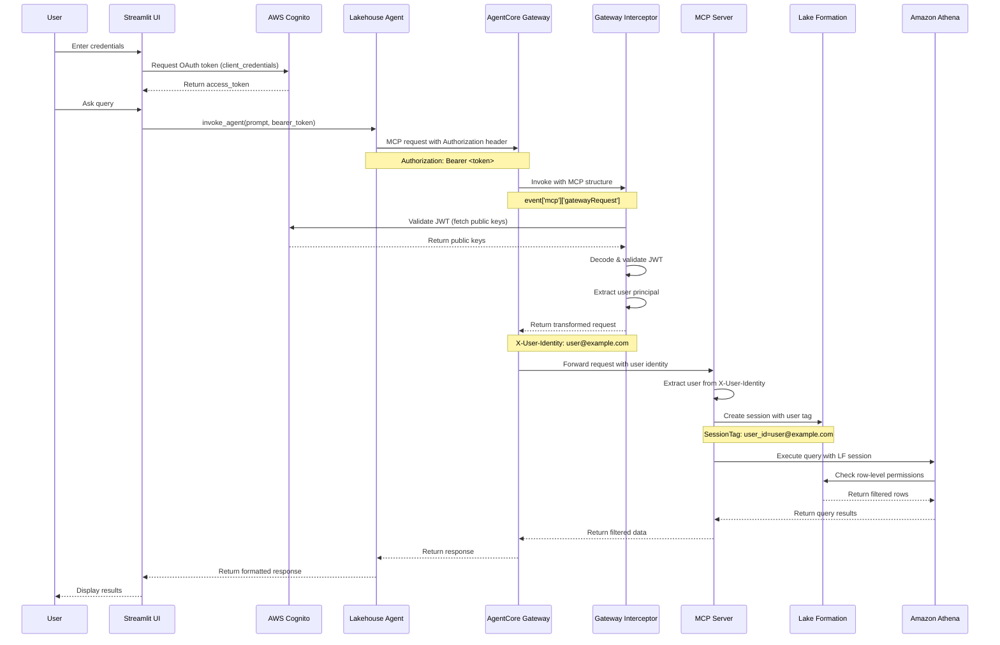

# OAuth Token Flow - Complete Architecture

## High-Level Flow



## Detailed Component Interactions

### 1. Authentication Phase

```
┌─────────────────────────────────────────────────────────────┐
│ Streamlit UI                                                 │
│                                                              │
│  def get_bearer_token(cognito_domain, client_id,            │
│                       client_secret, scope):                 │
│      POST {cognito_domain}/oauth2/token                      │
│      Body: {                                                 │
│        "grant_type": "client_credentials",                   │
│        "client_id": client_id,                               │
│        "client_secret": client_secret,                       │
│        "scope": scope                                        │
│      }                                                        │
│                                                              │
│  Response: {"access_token": "eyJraWQ...", ...}               │
└─────────────────────────────────────────────────────────────┘
```

### 2. Agent Invocation Phase

```
┌─────────────────────────────────────────────────────────────┐
│ Streamlit → Lakehouse Agent                                  │
│                                                              │
│  boto3.client('bedrock-agentcore').invoke_agent_runtime(    │
│      agentRuntimeArn=runtime_arn,                            │
│      payload={                                               │
│          "prompt": "Show me all my claims",                  │
│          "bearer_token": "eyJraWQ..."                        │
│      }                                                        │
│  )                                                            │
└─────────────────────────────────────────────────────────────┘
                         │
                         ▼
┌─────────────────────────────────────────────────────────────┐
│ Lakehouse Agent                                              │
│                                                              │
│  bearer_token = payload.get('bearer_token')                  │
│  auth_headers = {                                            │
│      'Authorization': f'Bearer {bearer_token}'               │
│  }                                                            │
│                                                              │
│  mcp_client = MCPClient(                                     │
│      lambda: streamablehttp_client(                          │
│          gateway_url,                                        │
│          headers=auth_headers                                │
│      )                                                        │
│  )                                                            │
└─────────────────────────────────────────────────────────────┘
```

### 3. Gateway Interception Phase

```
┌─────────────────────────────────────────────────────────────┐
│ AgentCore Gateway → Interceptor Lambda                       │
│                                                              │
│  Event Structure:                                            │
│  {                                                           │
│    "mcp": {                                                  │
│      "gatewayRequest": {                                    │
│        "headers": {                                          │
│          "Authorization": "Bearer eyJraWQ..."                │
│        },                                                    │
│        "body": {                                             │
│          "jsonrpc": "2.0",                                   │
│          "method": "tools/call",                             │
│          "params": {                                         │
│            "name": "query_claims",                           │
│            "arguments": {...}                                │
│          }                                                    │
│        }                                                      │
│      }                                                        │
│    }                                                          │
│  }                                                            │
└─────────────────────────────────────────────────────────────┘
                         │
                         ▼
┌─────────────────────────────────────────────────────────────┐
│ Interceptor Lambda Processing                                │
│                                                              │
│  1. Extract token from MCP structure                         │
│     token = event['mcp']['gatewayRequest']                   │
│                  ['headers']['Authorization']                │
│                                                              │
│  2. Validate JWT against Cognito                             │
│     - Fetch public keys from Cognito                         │
│     - Verify signature, audience, issuer                     │
│     - Check expiration                                       │
│                                                              │
│  3. Extract user principal from claims                       │
│     principal = claims.get('email') or                       │
│                 claims.get('username') or                    │
│                 claims.get('sub')                            │
│                                                              │
│  4. Transform request                                        │
│     - Add X-User-Identity header                             │
│     - Add X-User-Scopes header                               │
│     - Add context to body                                    │
│                                                              │
│  5. Return MCP format response                               │
└─────────────────────────────────────────────────────────────┘
                         │
                         ▼
┌─────────────────────────────────────────────────────────────┐
│ Interceptor Response                                         │
│                                                              │
│  {                                                           │
│    "interceptorOutputVersion": "1.0",                        │
│    "mcp": {                                                  │
│      "transformedGatewayRequest": {                         │
│        "headers": {                                          │
│          "Accept": "application/json",                       │
│          "Content-Type": "application/json",                 │
│          "X-User-Identity": "user@example.com",              │
│          "X-User-Scopes": "lakehouse-api/claims.query"       │
│        },                                                    │
│        "body": {                                             │
│          "jsonrpc": "2.0",                                   │
│          "method": "tools/call",                             │
│          "params": {                                         │
│            "name": "query_claims",                           │
│            "arguments": {                                    │
│              "context": {                                    │
│                "user_id": "user@example.com",                │
│                "scopes": ["lakehouse-api/claims.query"]      │
│              }                                                │
│            }                                                  │
│          }                                                    │
│        }                                                      │
│      }                                                        │
│    }                                                          │
│  }                                                            │
└─────────────────────────────────────────────────────────────┘
```

### 4. MCP Server Processing Phase

```
┌─────────────────────────────────────────────────────────────┐
│ MCP Server (server.py)                                       │
│                                                              │
│  def extract_user_identity(payload):                         │
│      headers = payload.get('headers', {})                    │
│      user_id = headers.get('X-User-Identity')                │
│      return user_id                                          │
│                                                              │
│  @app.tool(name="query_claims")                              │
│  def query_claims(...):                                      │
│      user_id = app.get_context().get('user_id')              │
│      tools = get_athena_tools()                              │
│      return tools.query_claims(user_id, filters)             │
└─────────────────────────────────────────────────────────────┘
                         │
                         ▼
┌─────────────────────────────────────────────────────────────┐
│ Athena Tools with Lake Formation (athena_tools_secure.py)   │
│                                                              │
│  def query_claims(self, user_id, filters):                   │
│      # Create Lake Formation session with user tag           │
│      session_tags = [                                        │
│          {'Key': 'user_id', 'Value': user_id}                │
│      ]                                                        │
│                                                              │
│      # Assume RLS role with session tags                     │
│      credentials = sts.assume_role(                          │
│          RoleArn=self.rls_role_arn,                          │
│          Tags=session_tags                                   │
│      )                                                        │
│                                                              │
│      # Execute Athena query with LF credentials              │
│      athena_client = boto3.client(                           │
│          'athena',                                           │
│          aws_access_key_id=credentials['AccessKeyId'],       │
│          aws_secret_access_key=credentials['SecretAccessKey'],│
│          aws_session_token=credentials['SessionToken']       │
│      )                                                        │
│                                                              │
│      # Lake Formation filters rows based on user_id tag      │
│      response = athena_client.start_query_execution(...)     │
└─────────────────────────────────────────────────────────────┘
```

## Security Layers

```
┌─────────────────────────────────────────────────────────────┐
│ Layer 1: OAuth Authentication (Cognito)                      │
│  - Client credentials flow                                   │
│  - JWT token generation                                      │
│  - Token expiration                                          │
└─────────────────────────────────────────────────────────────┘
                         │
                         ▼
┌─────────────────────────────────────────────────────────────┐
│ Layer 2: JWT Validation (Interceptor)                        │
│  - Signature verification                                    │
│  - Audience validation                                       │
│  - Issuer validation                                         │
│  - Expiration check                                          │
└─────────────────────────────────────────────────────────────┘
                         │
                         ▼
┌─────────────────────────────────────────────────────────────┐
│ Layer 3: Principal Extraction (Interceptor)                  │
│  - Extract user identity from JWT claims                     │
│  - Pass to downstream services                               │
└─────────────────────────────────────────────────────────────┘
                         │
                         ▼
┌─────────────────────────────────────────────────────────────┐
│ Layer 4: Row-Level Security (Lake Formation)                 │
│  - Session tags with user identity                           │
│  - Data filter expressions                                   │
│  - Automatic row filtering                                   │
└─────────────────────────────────────────────────────────────┘
```

## Key Points

### 1. MCP Protocol Compliance
- Event structure: `event['mcp']['gatewayRequest']`
- Response format: `interceptorOutputVersion` + `transformedGatewayRequest`
- Proper header and body transformation

### 2. JWT Token Flow
- Token generated by Cognito (client_credentials flow)
- Passed through all layers without modification
- Validated only once at the Gateway interceptor
- Principal extracted and passed downstream

### 3. User Identity Propagation
- Extracted from JWT claims at interceptor
- Added to `X-User-Identity` header
- Used by MCP server for Lake Formation session tags
- Enforces row-level security at data layer

### 4. No Token Storage
- Tokens never stored in databases
- Tokens passed in memory only
- Short-lived tokens (typically 1 hour)
- Refresh handled by Streamlit UI

## Testing the Flow

### 1. Test Authentication
```bash
curl -X POST https://{cognito-domain}/oauth2/token \
  -H "Content-Type: application/x-www-form-urlencoded" \
  -d "grant_type=client_credentials&client_id={client_id}&client_secret={client_secret}&scope={scope}"
```

### 2. Test Agent Invocation
```python
import boto3
import json

client = boto3.client('bedrock-agentcore')
response = client.invoke_agent_runtime(
    agentRuntimeArn='arn:aws:...',
    payload=json.dumps({
        'prompt': 'Show me all my claims',
        'bearer_token': 'eyJraWQ...'
    }).encode('utf-8')
)
```

### 3. Check Interceptor Logs
```bash
aws logs tail /aws/lambda/{interceptor-function-name} --follow
```

Look for:
- ✅ Bearer token extracted from MCP gateway request
- ✅ Extracted user principal: user@example.com
- ✅ Request authorized for user: user@example.com

### 4. Verify Lake Formation RLS
```sql
-- Query should only return rows where user_id matches the authenticated user
SELECT * FROM health_claims WHERE user_id = 'user@example.com';
```

## Troubleshooting

### Token Not Found
- Check: Is Authorization header present in request?
- Check: Is token in correct format: "Bearer <token>"?
- Check: Is MCP structure correct in event?

### JWT Validation Failed
- Check: Is Cognito User Pool ID correct?
- Check: Is App Client ID correct?
- Check: Is token expired?
- Check: Can interceptor reach Cognito JWKS endpoint?

### User Principal Not Found
- Check: Does JWT contain email, username, or sub claim?
- Check: Is token from correct Cognito User Pool?
- Check: Are custom claims configured correctly?

### Lake Formation RLS Not Working
- Check: Is X-User-Identity header present?
- Check: Is RLS role configured correctly?
- Check: Are session tags being passed?
- Check: Are data filters configured in Lake Formation?
